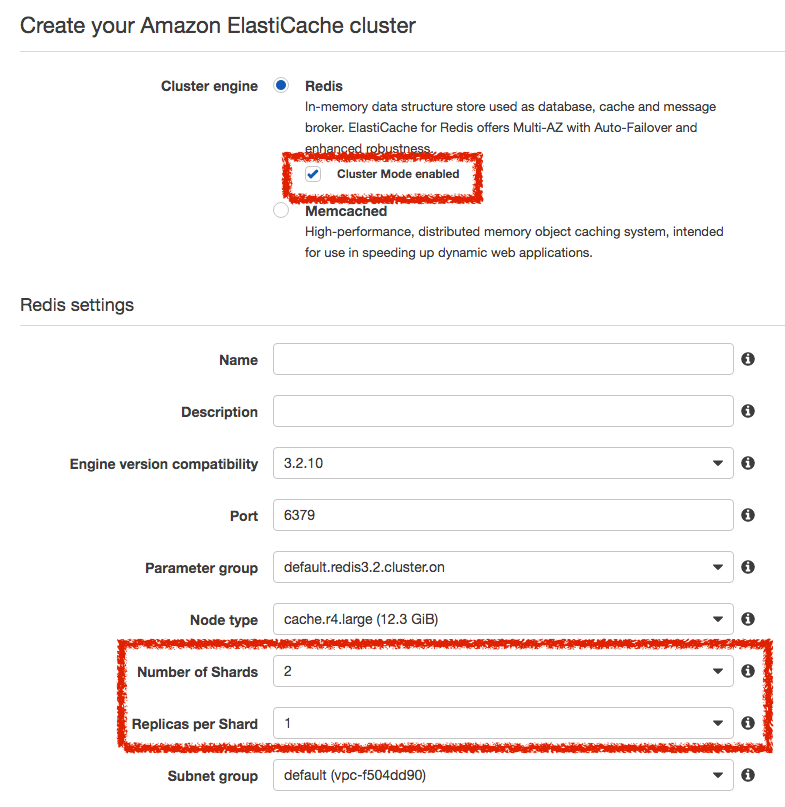
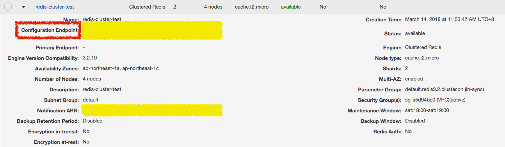

# AWS Redis 設定

> Laravel 版本：5.2


## AWS Redis Cluster Mode Enable 啟用群集模式

### 建立 Redis AWS Cluster Mode Enable 群集

建立 AWS Cluster Mode Enable 群集，將「Cluster Mode enabled」打勾，在下方的「Number of Shareds」設定資料分片數量，以及在「Replicas per Shared」設定每個分片數量要有幾個備援。



### 取得群集端點（Endpoint）

建立完群集之後，在列表中取得群集端點（Configuration Endpoint）



將群集端點設定到 `database.php`，並將 cluster 設定為 `true`，在設定檔加入 `options` 選項為 `['cluster' => 'redis']`，並設定預設的 `default` 連線。

```php
// 檔案位置：config/database.php
return [
    'redis' => [
        'cluster' => true,
        'options' => ['cluster' => 'redis'],
        'default' => [
            'host'     => env('REDIS_HOST', 'localhost'),
            'password' => env('REDIS_PASSWORD', null),
            'port'     => env('REDIS_PORT', 6379),
            // "persistent" => 'cache',
            'database' => 0,
        ],
        'session' => [
            'host'     => env('REDIS_HOST', 'localhost'),
            'password' => env('REDIS_PASSWORD', null),
            'port'     => env('REDIS_PORT', 6379),
            // "persistent" => 'cache',
            'database' => 0,
        ],
        'queue' => [
            'host'     => env('REDIS_HOST', 'localhost'),
            'password' => env('REDIS_PASSWORD', null),
            'port'     => env('REDIS_PORT', 6379),
            // "persistent" => 'cache',
            'database' => 0,
        ],
    ]
];
```

因為 AWS Redis Cluster Enabled 的模式，`database` 的數量固定只有第 0 個，所以若有用其他的 database 的話，記得要把所有的 database 改為 0。