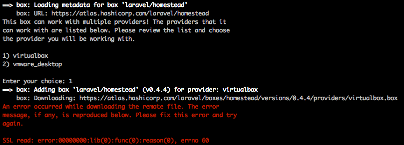

# Homestead

常常我我們需要開發Web Application時候，都需要花很長的時間把環境建置起來，而Homestead以讓我們透過簡單的設定檔，輕鬆的建置好整個執行環境，讓我們能夠更專注於在開發上

> OSX El Capitan 10.11.3

> Laravel 5.2

> Vagrant 1.8.1

> Virtualbox 5.0.14


## 安裝 Virtualbox

從 [VirtualBox 官方網站](https://www.virtualbox.org/wiki/Downloads) 下載並安裝 VirtualBox

下載連結：http://download.virtualbox.org/virtualbox/5.0.14/VirtualBox-5.0.14-105127-OSX.dmg


## 安裝 Vagrant

從 [Vagrant 官方網站](https://www.vagrantup.com/downloads.html) 下載並安裝 Vagrant

下載連結：https://releases.hashicorp.com/vagrant/1.8.1/vagrant_1.8.1.dmg

## 安裝 Homestead Vagrant Box

在 VirtualBox 及 Vagrant 安裝完後，使用下列指令將 Homestead 加入您的虛擬主機中

```shell
vagrant box add laravel/homestead
```

## 使用 Git 複製 Laravel homestead 並建立 Homestead 設定檔

```shell
$ git clone https://github.com/laravel/homestead.git Homestead
$ cd Homestead
~/Homestead$ bash init.sh
```


## 建立ssh key
```shell
$ ssh-keygen -t rsa -C "kejyun@homestead"
```

## 編輯 Homestead 設定檔

```shell
$ vim  ~/.homestead/Homestead.yaml
```

確認設定檔中ssh key有對應到正確的路徑

```
authorize: ~/.ssh/id_rsa.pub
keys:
    - ~/.ssh/id_rsa
```

## 設定虛擬主機提供者

vagrant 支援 `virtualbox`, `vmware_fusion` 或 `vmware_workstation` 這幾個虛擬主機，我們使用 VirtualBox 所以就填入 virtualbox

```
provider: virtualbox
```

### 設定本機程式碼路徑對應到測試環境的路徑共用資料夾

> map：本機路徑

> to：Vagrant測試機路徑


#### 程式路徑

```
folders:
    - map: ~/Code
      to: /home/vagrant/Code
    - map: ~/laravel52
      to: /home/vagrant/laravel52
```

#### 網站路徑

```
sites:
    - map: kejyun.app
      to: /home/vagrant/laravel52/public
```


## 設定 `/ect/hosts` 對應本機網址到 Vagrant

```shell
$ sudo vim /etc/hosts
```

加入下列設定

```
192.168.10.10   kejyun.app
```

> IP 位址為 Homestead.yaml 設定中的 ip 設定值，kejyun.app 則是參照設定檔中的 sites map 設定有哪些則加進去 hosts 設定檔中

## 啟動 Vagrant

```sh
~/Homestead $ vagrant up
```

> 在剛剛使用Git複製下來的homestead資料夾中執行vagrant up指令，會自動下載virtualbox相關的虛擬主機設定，並依照設定檔設置虛擬主機。


設定完成後可以開啟瀏覽器到 [http://kejyun.app](http://kejyun.app) 看看Homestead是否有正常啟動，若看到下列畫面表示可以正常運作了！！！


## 備註

若要關閉Homestead虛擬機器，則可以使用下列指令關閉

```sh
vagrant halt
```

若設定檔有修改要重新讀取，則可以使用下列指令重新讀取設定

```sh
vagrant provision
```


## SSL read: error:00000000:lib(0):func(0):reason(0), errno 60

若在啟動 homestead 時出現 SSL read 的錯誤訊息的話，可以重新加入新的 homestead vagrand box

```sh
$ vagrant up
Bringing machine 'default' up with 'virtualbox' provider...
==> default: Box 'laravel/homestead' could not be found. Attempting to find and install...
    default: Box Provider: virtualbox
    default: Box Version: >= 0.4.0
==> default: Loading metadata for box 'laravel/homestead'
    default: URL: https://atlas.hashicorp.com/laravel/homestead
==> default: Adding box 'laravel/homestead' (v0.4.4) for provider: virtualbox
    default: Downloading: https://atlas.hashicorp.com/laravel/boxes/homestead/versions/0.4.4/providers/virtualbox.box
An error occurred while downloading the remote file. The error
message, if any, is reproduced below. Please fix this error and try
again.

SSL read: error:00000000:lib(0):func(0):reason(0), errno 60
```



### 加入新的 homestead vagrand box

```sh
vagrant box add --insecure -c laravel/homestead http://atlas.hashicorp.com/laravel/boxes/homestead
```

```sh
$ vagrant box add --insecure -c laravel/homestead http://atlas.hashicorp.com/laravel/boxes/homestead
==> box: Loading metadata for box 'http://atlas.hashicorp.com/laravel/boxes/homestead'
This box can work with multiple providers! The providers that it
can work with are listed below. Please review the list and choose
the provider you will be working with.

1) virtualbox
2) vmware_desktop

Enter your choice: 1
==> box: Adding box 'laravel/homestead' (v0.4.4) for provider: virtualbox
    box: Downloading: https://atlas.hashicorp.com/laravel/boxes/homestead/versions/0.4.4/providers/virtualbox.box
==> box: Successfully added box 'laravel/homestead' (v0.4.4) for 'virtualbox'!
```

加入完成後，再重新啟動 homestead 即可


```sh
$ vagrant up
```

## 變更 Homestead 主機 ip

當我們想要有多台 Homestead 主機時，會因為 Homestead 預設的主機 ip 都為 `192.168.10.11` 而導致 ip 之間有衝突，所以我們也可以透過置換 ip 去達到同時開不同的 Homestead 主機。

```yaml
---
ip: "192.168.99.10"
```

我們僅需要將 ip 直接換成我們想要的 ip，這裡我將 ip 換成 `192.168.99.10`，換完 ip 之後，僅需要打 `vagrant reload` 這樣就可以成功將 ip 置換掉了！

```shell
vagrant reload
```


## 參考資料
* [Say Hello to Laravel Homestead 2.0](https://laracasts.com/lessons/say-hello-to-laravel-homestead-two)
* [Laravel - Homestead](http://laravel.com/docs/5.2/homestead)
* [Virtualbox](https://www.virtualbox.org/wiki/Downloads)
* [Vagrant](http://www.vagrantup.com/downloads.html)
* [Vagrant 常用指令](http://blog.kejyun.com/2014/10/vagrant-command.html)
* [SSL read: error · Issue #401 · Varying-Vagrant-Vagrants/VVV](https://github.com/Varying-Vagrant-Vagrants/VVV/issues/401)
* [Vagrant: Fix for error 60 / SSL read - Slick](http://slick.pl/kb/software/vagrant-fix-for-error-60-ssl-read/)
* [Change ip homestead](https://laracasts.com/discuss/channels/servers/change-ip-homestead)
