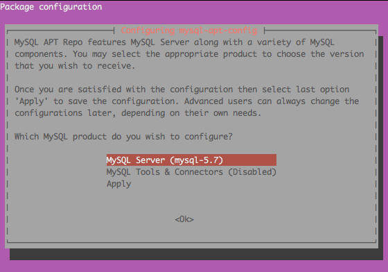
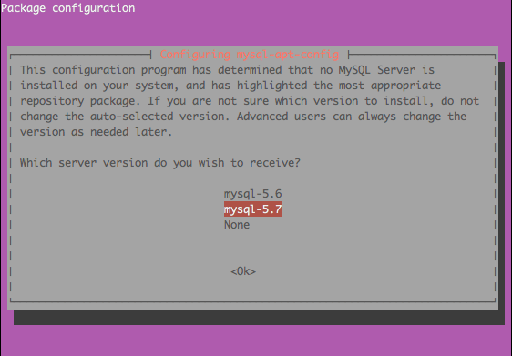

# 安裝 MySQL 5.7

## 設定 MySQL 5.7 套件資源庫

目前（2016/03） MySQL 5.7 沒有在 Ubuntu 的預設套件庫中，所以若要使用 MySQL 5.7 的話，則必須要設定加入此套件庫，這樣我們才能在 Ubuntu 安裝 MySQL 5.7

```shell
wget http://dev.mysql.com/get/mysql-apt-config_0.6.0-1_all.deb
sudo dpkg -i mysql-apt-config_0.6.0-1_all.deb
sudo dpkg-reconfigure mysql-apt-config
```

***設定使用 MySQL 當作預設安裝版本***





***設定完成點 Apply 完成設定***


## 更新套件資源庫

加入新的套件資源庫後，必須進行系統套件清單更新，才能夠讀取到新的套件設定

```shell
sudo apt-get update
```

## 安裝 MySQL

```shell
sudo apt-get install mysql-server-5.7
```

這樣就完成 MySQL 5.7 的安裝了！

## 參考資料
* [MySQL :: A Quick Guide to Using the MySQL APT Repository](https://dev.mysql.com/doc/mysql-apt-repo-quick-guide/en/)
* [MySQL :: Download MySQL APT Repository](https://dev.mysql.com/downloads/repo/apt/)
