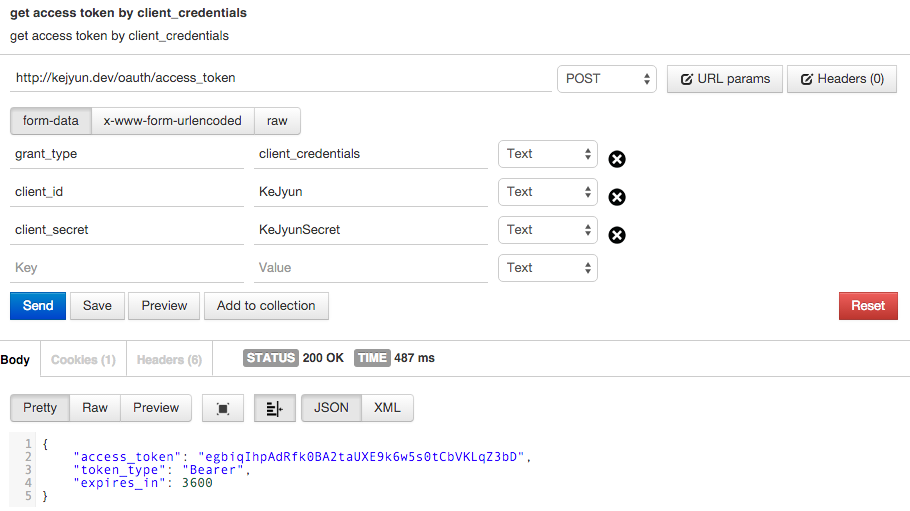

# OAuth2 Client Credentials

## 設定 config

在 `config/oauth2.php` 檔案中加入下列設定，並設定你的 `token 存活時間(access_token_ttl)`，單位時間為秒

```php
return [
    'grant_types' => [
        'grant_types' => [
            'client_credentials' => [
                'class' => '\League\OAuth2\Server\Grant\ClientCredentialsGrant',
                'access_token_ttl' => 3600
            ]
        ]
    ]
];
```


## 取得 Access token

在我們取得 Access token 的資料欄位中填入下列欄位

| 欄位名稱 | 資料 |
|---|---|
| grant_types | client_credentials |
| client_id | KeJyun |
| client_secret | KeJyunSecret |

> `client_id` 與 `client_secret` 為在 [OAuth 套件說明頁](package-auth-oauth2-README.md) 建立的




送出到我們設定的 `/oauth/access_token` 路由後，我們就可以直接取得 `access_token`，並回傳此 token 失效的時間 `expires_in` 為我們設定的 `access_token_ttl`

## 參考資料
* [Client Credentials](https://github.com/lucadegasperi/oauth2-server-laravel/wiki/Implementing-an-Authorization-Server-With-the-Client-Credentials-Grant)
