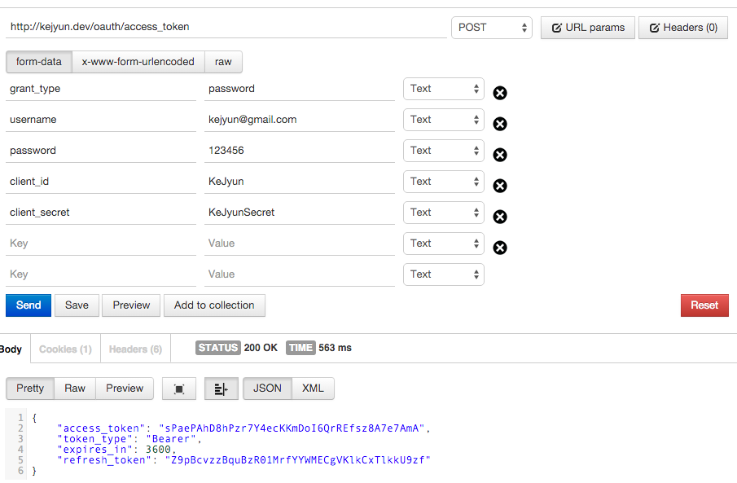
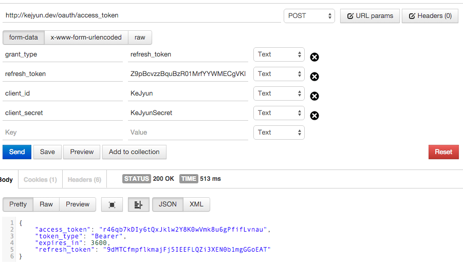

# OAuth2 Refresh Token

## 設定 config

在 `config/oauth2.php` 檔案中加入下列設定，並設定你的 `token 存活時間(access_token_ttl)` 及 `refresh token 存活時間(refresh_token_ttl)` 單位時間為秒

> 注意，若使用 Refresh Token 時，必須至少有 `Password Grant` 或 `Auth Code Grant` 的這兩種 OAuth2 驗證方法其中一種，然後在取得 Access token 時，會一併回傳 refresh token

```php
return [
    'grant_types' => [
        'refresh_token' => [
            'class' => '\League\OAuth2\Server\Grant\RefreshTokenGrant',
            'access_token_ttl' => 3600,
            'refresh_token_ttl' => 36000
        ]
    ]
];
```


## 使用 Password Grant 取得 Access token 及 Refresh Token

在我們取得 Access token 的資料欄位中填入下列欄位

| 欄位名稱 | 資料 |
|---|---|
| grant_types | password |
| username | kejyun@gmail.com |
| password | 123456 |
| client_id | KeJyun |
| client_secret | KeJyunSecret |

> `client_id` 與 `client_secret` 為在 [OAuth 套件說明頁](package-auth-oauth2-README.md) 建立的

> `username` 與 `password` 是你專案的使用者驗證資料，端看你驗證的 `callback` 如何定義這兩個欄位的資料，驗證成功後回傳使用者的編號給 OAuth2 記錄即可




送出到我們設定的 `/oauth/access_token` 路由後，我們就可以直接取得 `access_token`，並回傳此 token 失效的時間 `expires_in` 為我們設定的 `access_token_ttl`，還有 `refresh_token` 可以讓我們直接更新取得新的可用 token

> 使用 Refresh Token 取得的新的 Access token 權限與先前的 Access token 會完全相同

## 透過 Refresh Token 取得新的 Access Token

在我們取得 Access token 的資料欄位中填入下列欄位

| 欄位名稱 | 資料 |
|---|---|
| grant_types | refresh_token |
| refresh_token | Z9pBcvzzBquBzR01MrfYYWMECgVKlkCxTlkkU9zf |
| client_id | KeJyun |
| client_secret | KeJyunSecret |



這樣我們就可以直接透過 Refresh Token 取得新的可使用者 Access Token，而不用再透過使用者帳號密碼去取得可使用的 Access Token

## 相關資料表

OAuth2 會將 token 記錄在 `oauth_access_tokens` 資料表，並將關聯的使用者記錄在 `oauth_sessions` 資料表，在 `oauth_sessions` 中的 `owner_id` 則為我們剛剛回傳的使用者編號

並在 `oauth_refresh_tokens` 資料表中記錄 Refresh Token 是屬於哪一個 Access Token，並透過這個關聯去產生新的 Access Token 與新的 Refresh Token

## 參考資料
* [Refresh Token](https://github.com/lucadegasperi/oauth2-server-laravel/wiki/Implementing-an-Authorization-Server-with-the-Refresh-Token-Grant)

!INCLUDE "../../../kejyun/book/laravel-5-for-beginner.md"
