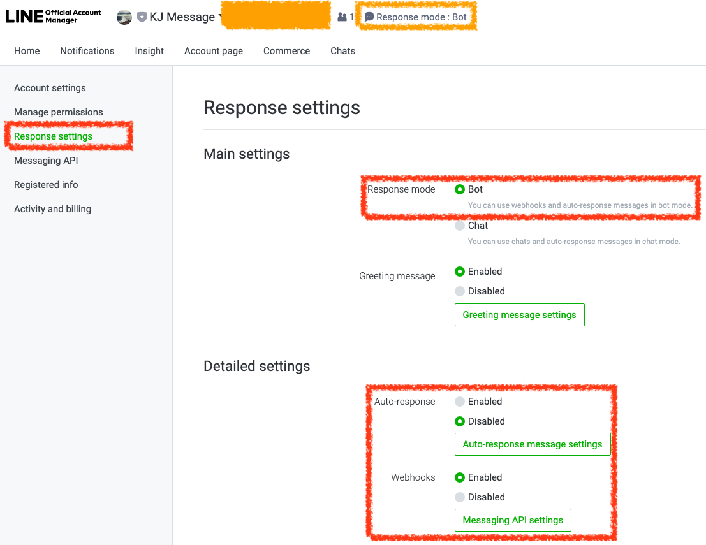

# Line Bot

*登入管理平台*

登入 [LINE Official Account Manager](https://manager.line.biz/) 後，點選上方 `Response mode` 將模式改為 `Bot`

*啟用 Webhook*

在 `Response settings` 頁面，確認 `Response mode` 為 `Bot`

將 `Auto-response` 關閉，並啟用 `Webhooks`



*設定 Message API*

在 `Messaging API` 選單中，取得 `Channel ID` 及 `Channel secret`，並設定 `Webhook URL`

當使用者輸入訊息時，則會呼叫此 URL


*安裝 Line 套件*

```
composer require linecorp/line-bot-sdk
```

套件網址：[line/line-bot-sdk-php: LINE Messaging API SDK for PHP](https://github.com/line/line-bot-sdk-php)

*取得 Access Token*


```php
<?php
// Line 頻道編號
$channel_id = 'my-line-channel-id';
// Line 頻道密鑰
$channel_secret = 'my-line-channel-secret';

$LineBot = new \LINE\LINEBot(
     new \LINE\LINEBot\HTTPClient\CurlHTTPClient(''),
    ['channelSecret' => $channel_secret]
);

$Response = $LineBot->createChannelAccessToken($channel_id);
$channel_access_token = $Response->getJSONDecodedBody();
$access_token = array_get($channel_access_token, 'access_token');
```


*透過 Access Token 回覆訊息給使用者*

當使用者回覆你的 Line 帳號時，Line Bot 會將使用者回覆的訊息像下方這樣傳送給你，需要回覆給使用者時，可以回覆到這次的 `replyToken`

> PS: 每次的 `replyToken` 皆不同

```
array (
  'events' =>
  array (
    0 =>
    array (
      'type' => 'message',
      'replyToken' => 'd439xxxxxxx1fc48',
      'source' =>
      array (
        'userId' => 'xxxx',
        'type' => 'user',
      ),
      'timestamp' => 1565081621327,
      'message' =>
      array (
        'type' => 'text',
        'id' => '10343775297084',
        'text' => 'hi kejyun line bot',
      ),
    ),
  ),
  'destination' => 'Ued2b13xxxxxx804b',
)
```


```php
<?php
// 取得 Line 傳送過來的資料
$input = request()->all();

// 取得 Reply Token
$reply_token = array_get($input, 'events.0.replyToken');

// 回覆訊息給使用者
$textMessageBuilder = new \LINE\LINEBot\MessageBuilder\TextMessageBuilder('Hello Line Friend');
$response = $bot->replyMessage(reply_token, $textMessageBuilder);


if ($response->isSucceeded()) {
    // 回覆訊息成功
    echo 'Succeeded!';
    Log::debug('Success');
} else {
    // 回覆訊息失敗
    Log::debug('Fail');
    Log::debug($response->getHTTPStatus());
    Log::debug($response->getRawBody());
}
```

其他相關的 API 請參考 [Messaging API reference](https://developers.line.biz/en/reference/messaging-api/)

## 參考資料
* [LINE Official Account Manager](https://manager.line.biz/)
* [Messaging API reference](https://developers.line.biz/en/reference/messaging-api/)
* [line/line-bot-sdk-php: LINE Messaging API SDK for PHP](https://github.com/line/line-bot-sdk-php)
