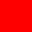
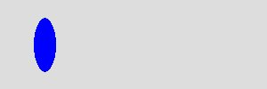
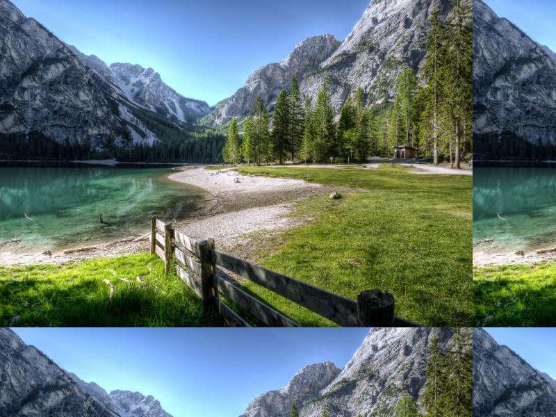
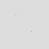
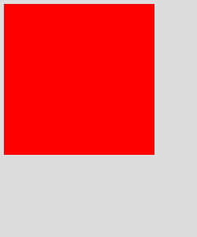
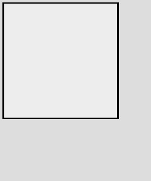
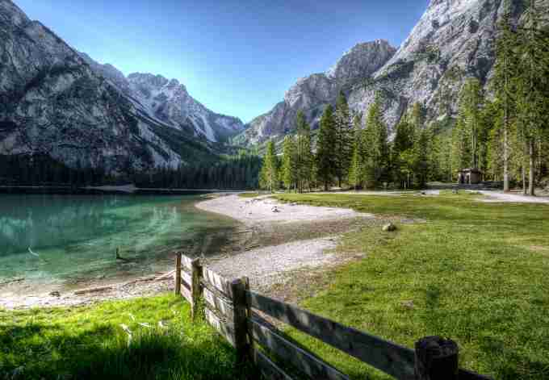

# Intervention Image 其他圖片處理

## cache() 快取

```php
// 試著讀取快取的圖片
$img = Image::cache(function($image) {
    // 讀取本機圖片，將圖片 resize 至 300x200，並作灰階處理
    return $image->make('public/foo.jpg')
        ->resize(300, 200)
        ->greyscale();
});
```

若用檔案快取，快取的圖片資料會存放在 `storage/framework/cache/data` 目錄下。

* [Intervention/imagecache: Caching extension for the Intervention Image Class](https://github.com/Intervention/imagecache)


## canvas() 建立圖片畫布

```php
// 建立畫布
$img = Image::canvas(300, 100);
```


**Image::canvas(300, 100);**

```php
// 建立畫布，並使用 #ff0000 顏色當作背景
$img = Image::canvas(32, 32, '#ff0000');
```



**Image::canvas(32, 32, '#ff0000');**


## ellipse() 畫橢圓

```php
// 建立顏色為 #ddd，寬度 300px，高度 100px 的畫布
$img = Image::canvas(300, 100, '#ddd');

// 在畫布中畫出寬度 25px，高度 60px，位置在 (50,50) ，顏色為 #0000ff 的橢圓
$img->ellipse(25, 60, 50, 50, function ($draw) {
    $draw->background('#0000ff');
});
```



**$img->ellipse(25, 60, 50, 50) color #0000ff**


## exif() 取得圖片 exif 資訊

必須使用 Imagick 2.3.9 的函式庫，並且必須編譯 `--enable-exif`，且有 `mbstring` 的套件才可取得 exif 資訊

```php
// 取得所有 exif 資訊
$data = Image::make('public/foo.jpg')->exif();

// 讀取鏡頭 Model
$name = Image::make('public/foo.jpg')->exif('Model');
```


## filesize() 檔案大小

當檔案不是從實際的檔案讀取，則會回傳 false

```php
// 建立圖片實例
$img = Image::make('public/foo.jpg');

// 取得檔案大小
$size = $img->filesize();
```

## fill() 填滿顏色或圖片

```php
// 建立畫布，寬度 800px 高度 600px
$img = Image::canvas(800, 600);

// 填滿 #ff5500 顏色
$img->fill('#ff5500');
```


**$img->fill('#ff5500');**

```php
// 填滿圖片
$img->fill('tile.png');
```



**$img->fill('tile.png');**


## filter() 指定過濾器

可以將一些常用的過濾規則通通寫在過濾器中，這樣就可以直接指定 Filter 去做過濾

```php
// init new image instance
$img = Image::make('foo.jpg');

// apply filter
$img->filter(new DemoFilter(45));
```


```php
<?php

namespace Intervention\Image\Filters;

class DemoFilter implements FilterInterface
{
    const DEFAULT_SIZE = 10;
    private $size;

    public function __construct($size = null)
    {
        $this->size = is_numeric($size) ? intval($size) : self::DEFAULT_SIZE;
    }

    /**
     * 執行圖片過濾
     */
    public function applyFilter(\Intervention\Image\Image $image)
    {
        $image->pixelate($this->size);
        $image->greyscale();

        return $image;
    }
}
```


## width() 圖片寬度

```php
// 取得圖片寬度
$width = Image::make('public/foo.jpg')->width();
```

## height() 圖片高度

```php
// 取得圖片高度
$height = Image::make('public/foo.jpg')->height();
```


## interlace() 交錯模式

如果是 JPEG 的圖片，將會把圖片儲存成 progressive JPEG 的圖片

```php
// 建立圖片實例
$img = Image::make('public/foo.png');

// 啟用 interlacing
$img->interlace();

// 儲存為 interlaced 的圖片
$img->save();

// 開啟 interlaced 圖片
$img = Image::make('public/interlaced.gif');

// 關閉 interlacing
$img->interlace(false);

// 儲存為 standard mode 的圖片
$img->save();
```

## mime() 取得圖片 mime

```php
$mime = Image::make('public/foo.jpg')->mime();
```


## pickColor() 選出圖片顏色色碼

```php
// 建立圖片實例
$img = Image::make('public/foo.jpg');

// 選出位置在 (100,100) 的像素顏色: 陣列資料
$arraycolor = $img->pickColor(100, 100);

/*
array:4 [
  0 => 43
  1 => 58
  2 => 78
  3 => 1.0
]
*/

// 選出位置在 (100,100) 的像素顏色: rgb
$rgb_color = $img->pickColor(100, 100, 'rgb');
// rgba(43, 58, 78)

// 選出位置在 (100,100) 的像素顏色: rgba
$rgba_color = $img->pickColor(100, 100, 'rgba');
// rgba(43, 58, 78, 1.00)


// 選出位置在 (100,100) 的像素顏色: hex
$hex_color = $img->pickColor(100, 100, 'hex');
// #2b3a4e
```


## pixel() 在指定像素點畫出顏色

```php
// 建立畫布
$img = Image::canvas(100, 100, '#ddd');

// 在 (32,32) 像素畫出藍色
$img->pixel('#0000ff', 32, 32);

// 在 (32,32) 像素畫出紅色
$img->pixel('#ff0000', 64, 64);
```



**$img->pixel();**


## polygon() 畫出多邊形

```php
// 建立畫布
$img = Image::canvas(800, 600, '#ddd');

// 定義多邊形位置
$points = array(
    40,  50,  // Point 1 (x, y)
    20,  240, // Point 2 (x, y)
    60,  60,  // Point 3 (x, y)
    240, 20,  // Point 4 (x, y)
    50,  40,  // Point 5 (x, y)
    10,  10   // Point 6 (x, y)
);

// 畫出多邊形
$img->polygon($points, function ($draw) {
    // 背景顏色 #000ff
    $draw->background('#0000ff');
    // 邊框寬度 1，顏色 #ff0000
    $draw->border(1, '#ff0000');
});
```


## rectangle() 畫出四邊形

```php
// 建立畫布
$img = Image::canvas(250, 300, '#ddd');

// 畫出紅色四邊形
$img->rectangle(5, 5, 195, 195, function ($draw) {
    $draw->background('#ff0000');
});
```



**$img->rectangle() background #ff0000**


```php
// 畫出透明度 0.5 的四邊形，使用 2px 黑色邊框
$img->rectangle(5, 5, 195, 195, function ($draw) {
    $draw->background('rgba(255, 255, 255, 0.5)');
    $draw->border(2, '#000');
});
```



**$img->rectangle() background rgba(255, 255, 255, 0.5) border 2px #000**


## response() 回應包含 HTTP Header 圖片

**參數1: 圖片類型**

* jpg — return JPEG encoded image data
* png — return Portable Network Graphics (PNG) encoded image data
* gif — return Graphics Interchange Format (GIF) encoded image data
* tif — return Tagged Image File Format (TIFF) encoded image data
* bmp — return Bitmap (BMP) encoded image data

**參數2: 圖片品質**

* 數值介於 0~100

```php
// 建立圖片實例
$img = Image::make('public/foo.jpg');
return $img->response();

// 回應 png 圖片
return $img->response('jpg');
```


**$img->response('jpg');**

```php
// 回應 jpg 圖片 品質 20
return $img->response('jpg', 20);
```



**$img->response('jpg', 20);**


!INCLUDE "../../../kejyun/book/laravel-5-for-beginner.md"
