# Intervention Image 圖片處理

## 原始圖片


## resize() 圖片縮放

```php
// 建立圖片實例
$img = Image::make('public/foo.jpg');

// 重新調整圖片寬高至 300x200
$img->resize(300, 100);
```


**resize to 300x100**

```php
// 寬度調整至 300px，高度不變
$img->resize(300, null);
```


**resize to 300xnull**


```php
// 高度調整至 200px，寬度不變
$img->resize(null, 100);
```


**resize to nullx100**


```php
// 固定寬 300px，高度等比例縮放
$img->resize(300, null, function ($constraint) {
    $constraint->aspectRatio();
});
```


**resize to 300xnull aspectRatio**

```php
// 固定高 100px，寬度等比例縮放 width)
$img->resize(null, 100, function ($constraint) {
    // 等比例縮放
    $constraint->aspectRatio();
});
```


**resize to nullx100 aspectRatio**


```php
$img->resize(null, 1000, function ($constraint) {
    // 等比例縮放
    $constraint->aspectRatio();
    // 若圖片較小，不需要將圖片放大
    $constraint->upsize();
});
```


**resize to nullx1000 aspectRatio & upsize**

## crop() 圖片裁切

```php
// 建立圖片實例
$img = Image::make('public/foo.jpg');

// 裁切圖片寬度 100px，高度 300px，從圖片中間為中心點開始裁切
$img->crop(100, 300);
```

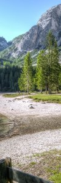

**$img->crop(100, 300);**

```php
// 從圖片左上角為原點 0,0，然後裁切圖片寬度 100px，高度 300px
$img->crop(100, 300, 0, 0);
```

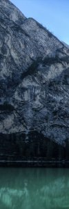

**$img->crop(100, 300);**

```php
// 從圖片左上角為原點，往右位移 35px，往下位移 75px，然後裁切圖片寬度 100px，高度 300px
$img->crop(100, 300, 35, 75);
```


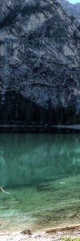

**$img->crop(100, 300, 35, 75);**


## blur() 模糊

可以指定模糊的強度，數字介於 0~100 之間，預設為 1

```php
// 建立圖片實例
$img = Image::make('public/foo.jpg');

// 輕微的模糊圖片（預設強度 1）
$img->blur();
```


**$img->blur();**

```php
// 指定模糊的強度
$img->blur(15);
```


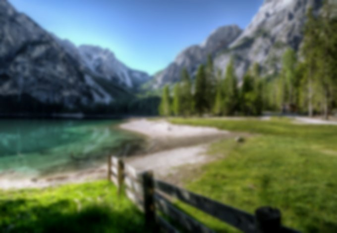

**$img->blur(15);**


## brightness() 亮度

可以指定增加或減少圖片的亮度多少，亮度數值介於 -100 ~ 100 之間

```php
// 建立圖片實例
$img = Image::make('public/foo.jpg');

// 增加圖片亮度 35
$img->brightness(35);
```

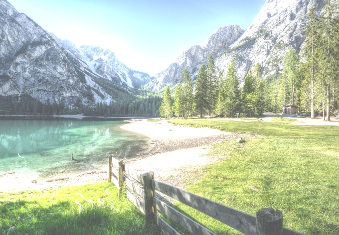

**$img->brightness(35);**


```php
// 減低圖片亮度 -5，再減低亮度 -25
$img->brightness(-5)->brightness(-25);
```


**$img->brightness(-5)->brightness(-25);**


## colorize() 顏色增減

顏色可以帶入 red, green, blue 三種顏色增減的量，範圍為 -100~100，0 則為不變

```php
// 建立圖片實例
$img = Image::make('public/foo.jpg');

// 紅色 -100
$img->colorize(-100, 0, 0);
```

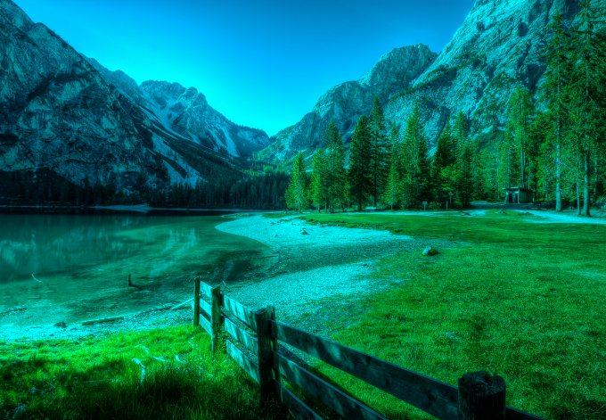

**$img->colorize(-100, 0, 0);**

```php
// 紅色 100
$img->colorize(100, 0, 0);
```

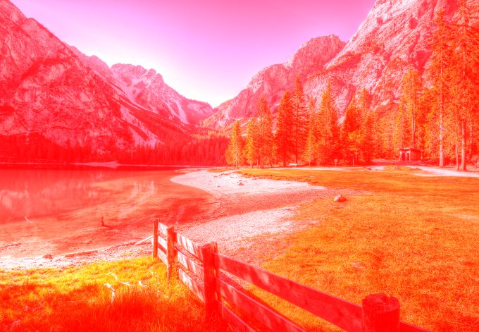

**$img->colorize(100, 0, 0);**

```php
// 綠色 30
$img->colorize(0, 30, 0);
```

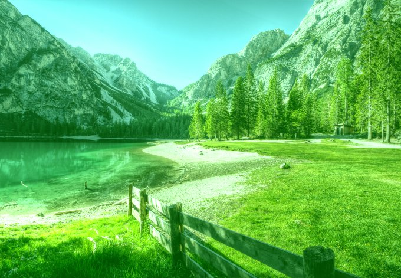

**$img->colorize(0, 30, 0);**


## contrast() 對比

對比的數字介於 -100~100

```php
// 建立圖片實例
$img = Image::make('public/foo.jpg');

// 增加對比 65
$img->contrast(65);
```

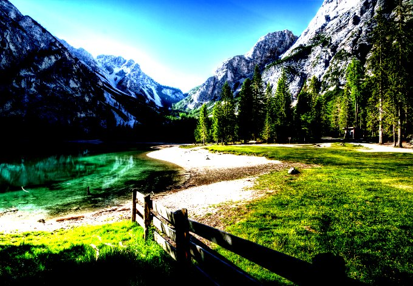

**$img->contrast(65);**

```php
// 增加對比 100
$img->contrast(100);
```

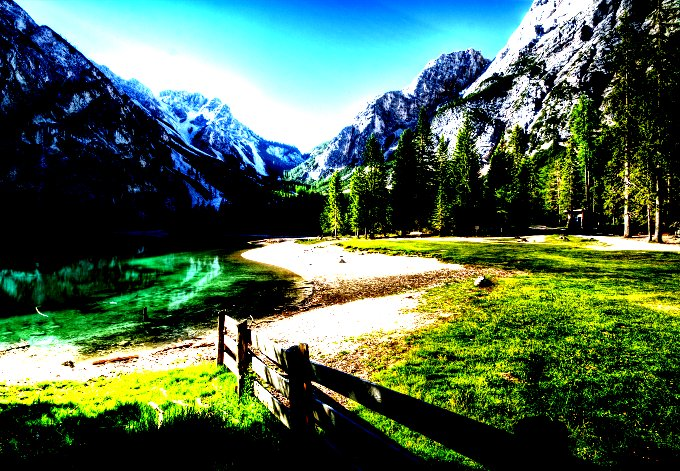

**$img->contrast(100);**

```php
// 減少對比 35
$img->contrast(-35);
```


**$img->contrast(-35);**

## encode() 編碼

* jpg — return JPEG encoded image data
* png — return Portable Network Graphics (PNG) encoded image data
* gif — return Graphics Interchange Format (GIF) encoded image data
* tif — return Tagged Image File Format (TIFF) encoded image data
* bmp — return Bitmap (BMP) encoded image data
* ico — return ICO encoded image data
* psd — return Photoshop Document (PSD) encoded image data
* webp — return WebP encoded image data
* data-url — encode current image data in data URI scheme (RFC 2397)

```php
// 將 png 圖片轉為 jpg，並使用 quality 75 的圖片
$jpg = (string) Image::make('public/foo.png')->encode('jpg', 75);

// 將 png 圖片轉為網址 base64 的圖片
$data = (string) Image::make('public/bar.png')->encode('data-url');
```


## flip() 翻轉


```php
// 建立圖片實例
$img = Image::make('public/foo.jpg');

// 垂直翻轉
$img->flip('v');
```


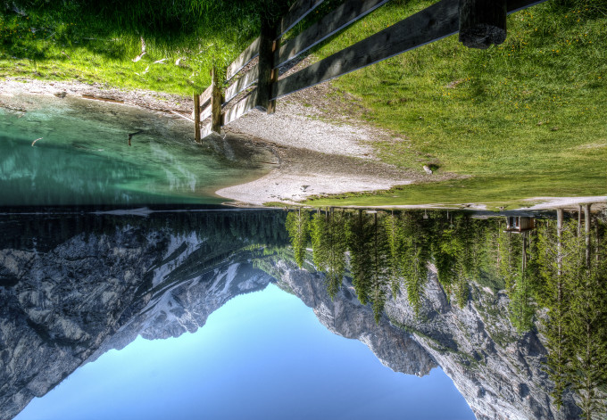

**$img->flip('v');**


```php
// 水平翻轉
$img->flip('h');
```

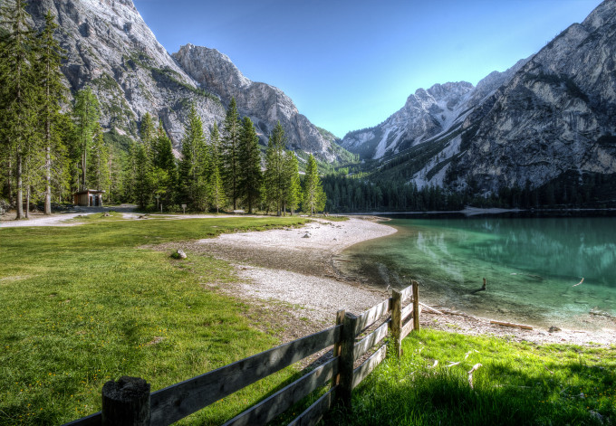

**$img->flip('h');**

```php
// 水平+垂直翻轉
$img->flip('h')->flip('v');
```

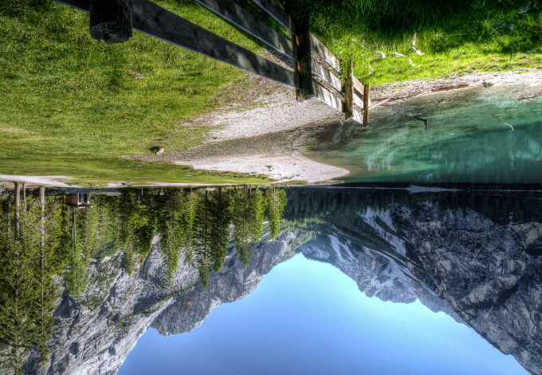

**$img->flip('h')->flip('v');**


## fit() 裁切(crop) + 圖片縮放(resize)

```php
// 建立圖片實例
$img = Image::make('public/foo.jpg');

// 圖片固定圖片比例，縮放至 300x100，並將將超過 300x100 的部分裁切掉
$img->fit(300,100);
```

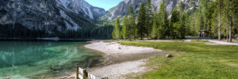

**$img->fit(300,100);**


```php
// 圖片使用 300x300 的 1:1 比例，將圖片填滿
$img->fit(300);
$img->fit(300,300);
```

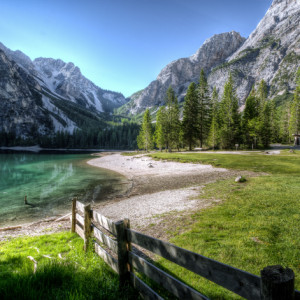

**$img->fit(300);**

```php
// 圖片固定圖片比例，縮放至 1200x1000，並將將超過 1200x1000 的部分裁切掉，且避免圖片放大超過原本圖片尺寸
$img->fit(1200, 1000, function ($constraint) {
    // 避免圖片放大超過原本尺寸
    $constraint->upsize();
});
```

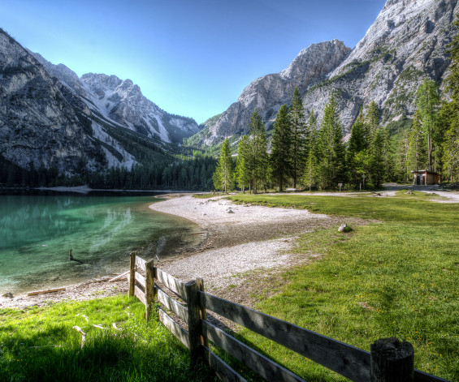

**$img->fit(1200, 1000); upsize()**


## gamma() Gamma 校正

```php
// 建立圖片實例
$img = Image::make('public/foo.jpg');

// Gamma 校正 1.6
$img->gamma(1.6);
```

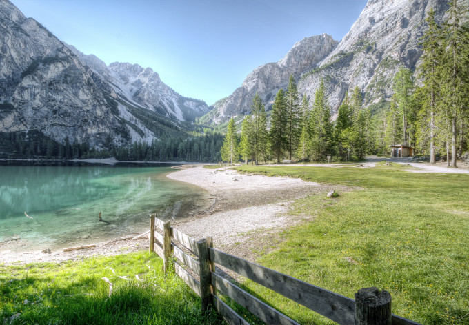

**$img->gamma(1.6);**


```php
// Gamma 校正 1/2.2
$img->gamma(1 / 2.2);
```

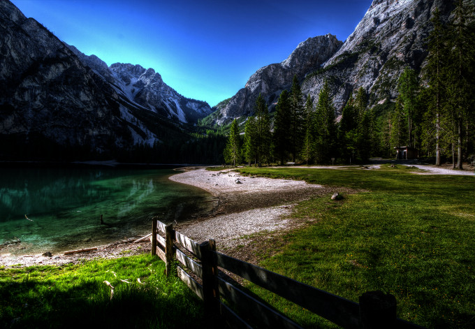

**$img->gamma(1 / 2.2);**


## greyscale() 灰階

```php
// 建立圖片實例
$img = Image::make('public/foo.jpg');

// 灰階
$img->greyscale();
```


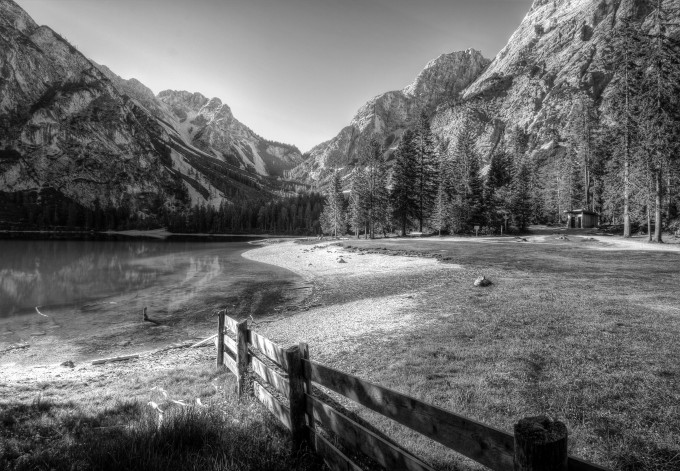

**$img->greyscale();**


## heighten() 重新縮放圖片，以圖片高度為主，等比例縮放


```php
// 圖片高度縮放至 100px，並依照原本圖片比例縮放
$img = Image::make('public/foo.jpg')->heighten(100);
```


**$img->heighten(100);**


```php
// 圖片高度縮放至 1000px，並依照原本圖片比例縮放，不將原本圖片放大
$img = Image::make('public/foo.jpg')->heighten(1000, function ($constraint) {
    // 若圖片較小，不需要將圖片放大
    $constraint->upsize();
});
```


**$img->heighten(1000); upsize()**


## widen() 重新縮放圖片，以圖片寬度為主，等比例縮放

```php
// 圖片寬度縮放至 100px，並依照原本圖片比例縮放
$img = Image::make('public/foo.jpg')->widen(100);
```


**$img->widen(100);**

```php
// 圖片寬度縮放至 1000px，並依照原本圖片比例縮放，不將原本圖片放大
$img = Image::make('public/foo.jpg')->widen(1000, function ($constraint) {
    $constraint->upsize();
});
```


**$img->widen(1000); upsize()**


## insert() 插入浮水印圖片


```php
// 建立圖片實例
$img = Image::make('public/foo.jpg');

// 直接插入圖片，以左上角為起點開始插入圖片
$img->insert('public/copyright.png');
```

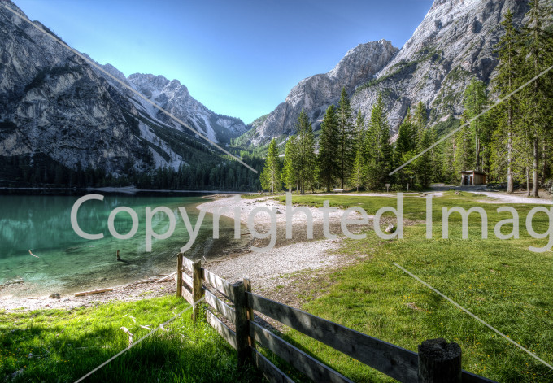

**$img->insert('public/copyright.png');**


```php
// 插入圖片至中央
$watermark = Image::make('public/watermark.png');
$img->insert($watermark, 'center');
```

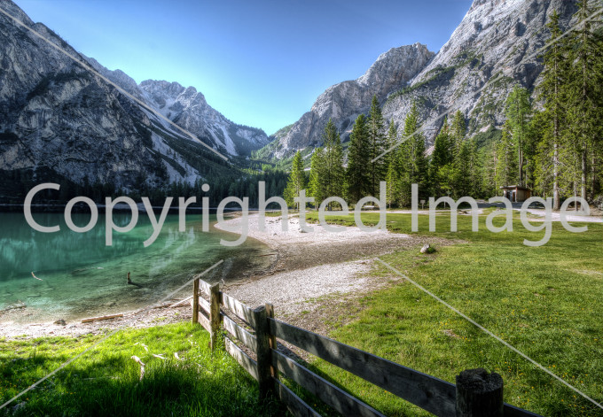

**$img->insert($watermark, 'center');**

```php
// 插入圖片，從右下角起點，往左 10px，往上 50px
$watermark = Image::make('public/watermark.png');
$img->insert('public/watermark.png', 'bottom-right', 10, 50);
```

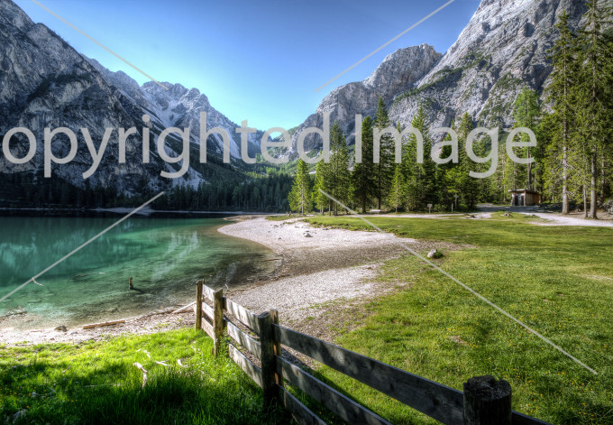

**$img->insert('public/watermark.png', 'bottom-right', 10, 50);**


## invert() 反轉顏色

```php
// 反轉圖片顏色
$img = Image::make('public/foo.jpg')->invert();
```

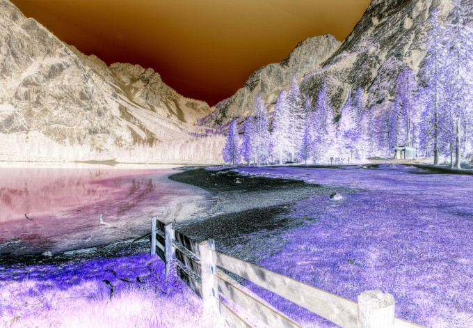

**$img->invert();**


## limitColors() 限制顯示顏色數量


```php
// 建立圖片實例
$img = Image::make('public/foo.png');
// 限制顏色數量為 100
$img->limitColors(100);
```

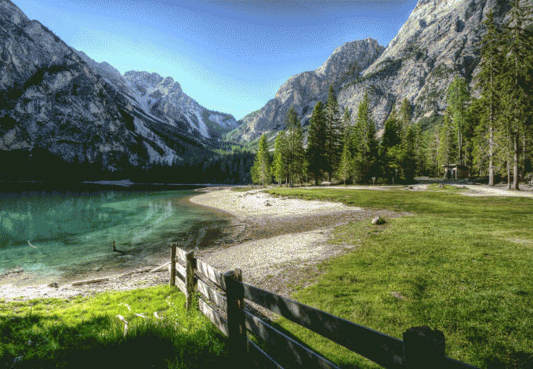

**$img->limitColors(100);**


```php
// 限制顏色數量為 30
$img->limitColors(30);
```

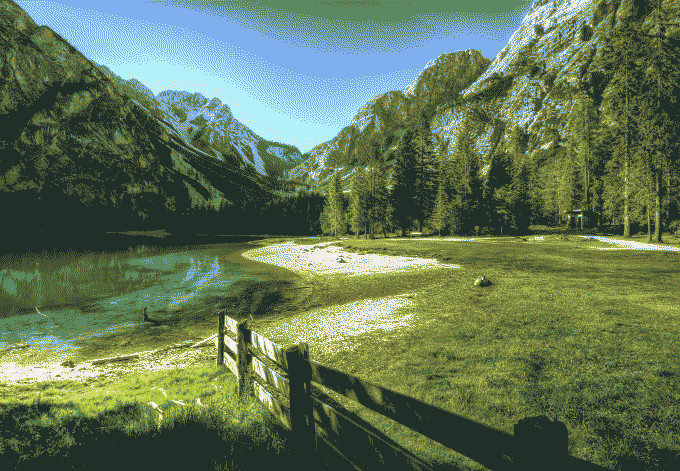

**$img->limitColors(30);**


## line() 畫線

> 必須要使用 Imagick 函式庫

```php
// 建立圖片實例
$img = Image::make('public/foo.png');

// 畫一條 5px 的紅線，從座標 (10,10) 到 (195, 195)
$img->line(10, 10, 195, 195, function ($draw) {
    $draw->color('#f00');
    $draw->width(5);
});
```


**$img->line(10, 10, 195, 195) color #f00 width5**


## mask() 遮罩

```php
// 建立圖片實例
$img = Image::make('public/foo.jpg');

// 建立圖片遮罩，有顏色的部分會為遮罩
$img->mask('public/mask.png');
```

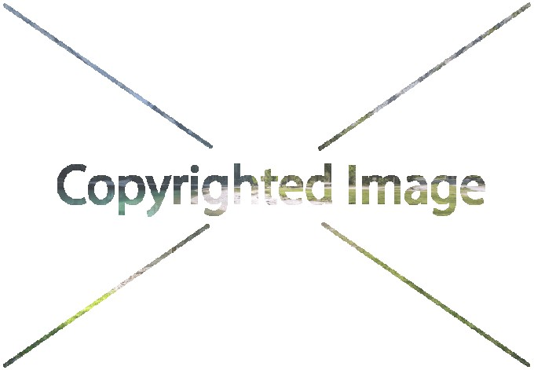

**$img->mask('public/mask.png');**

```php
// 建立圖片遮罩，有顏色且不為透明的部分會為遮罩
$img->mask('public/alpha.png', true);
```

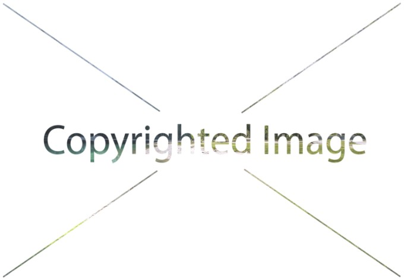

**$img->mask('public/alpha.png', true);**


## pixelate() 將圖片指定像素寬度像素化

```php
// 建立圖片實例
$img = Image::make('public/foo.jpg');

// 像素化效果:5px
$img->pixelate(5);
```


**$img->pixelate(5);**


```php
// 像素化效果:12px
$img->pixelate(12);
```


**$img->pixelate(12);**

```php
// 像素化效果:30px
$img->pixelate(30);
```

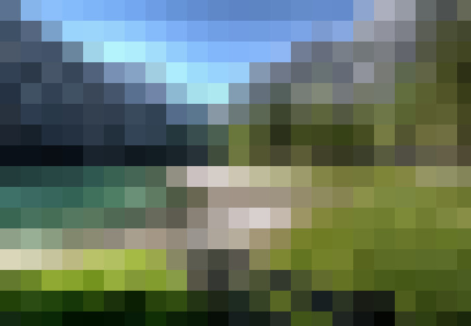

**$img->pixelate(30);**

## rotate() 旋轉圖片

```php
// 建立圖片實例
$img = Image::make('public/foo.jpg');

// 順時針旋轉圖圖片 45'
$img->rotate(-45);
```

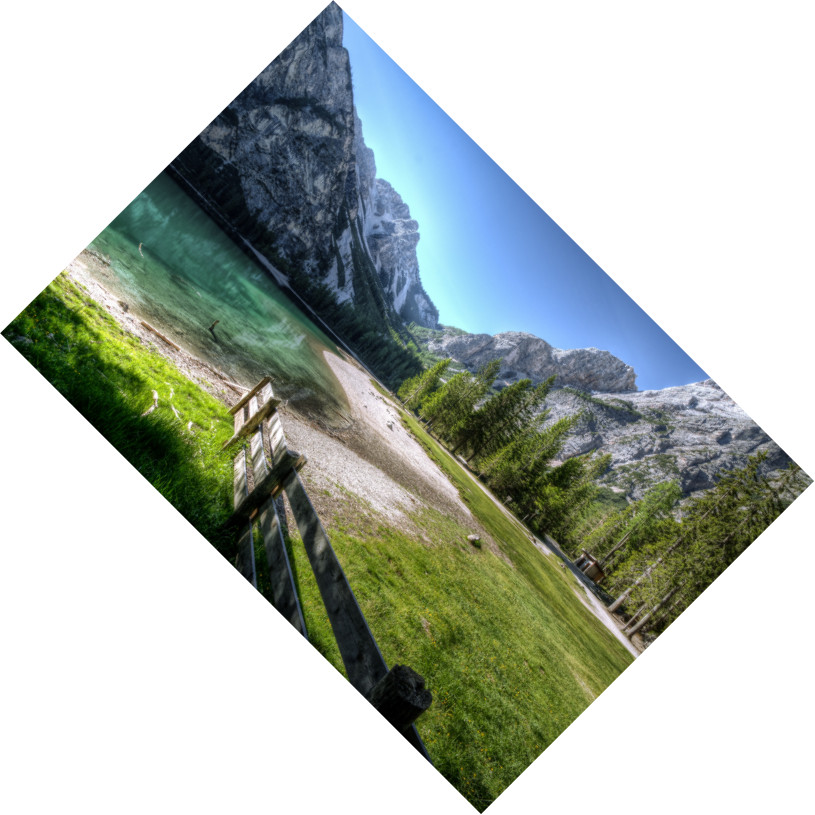

**$img->rotate(-45);**

## save() 儲存圖片

第一個參數是檔案路徑，第二個參數是圖片品質，數值介於 0~100

```php
// 建立圖片實例
$img = Image::make('public/foo.jpg');

// 儲存圖片，使用 60 品質的分數去儲存
$img->save('public/bar.jpg', 60);

// 儲存相同的圖片
$img->save('public/baz.jpg');

// 儲存 png 格式的圖片
$img->save('public/bar.png');
```

## sharpen() 銳利度

銳利度數值介於 0~100

```php
// 建立圖片實例
$img = Image::make('public/foo.jpg');

// 銳利度 15
$img->sharpen(15);
```


**$img->sharpen(15);**

```php
// 銳利度 70
$img->sharpen(70);
```

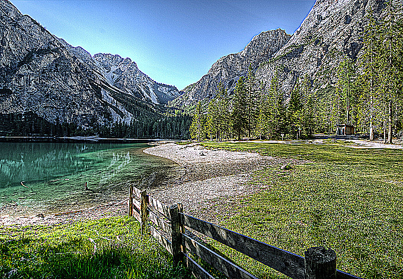

**$img->sharpen(70);**

!INCLUDE "../../../kejyun/book/laravel-5-for-beginner.md"
