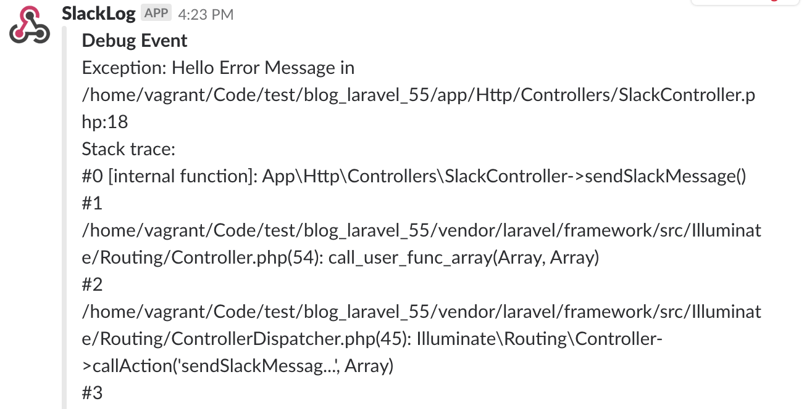
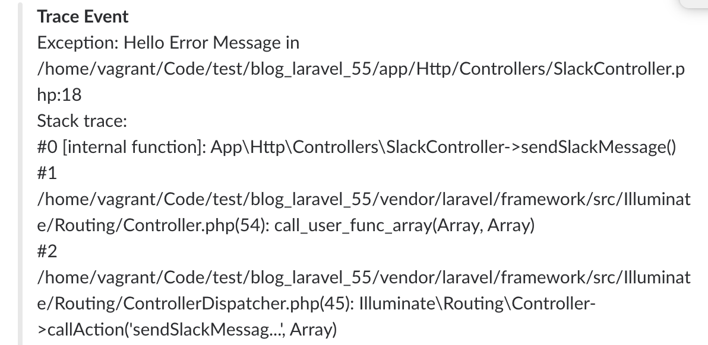
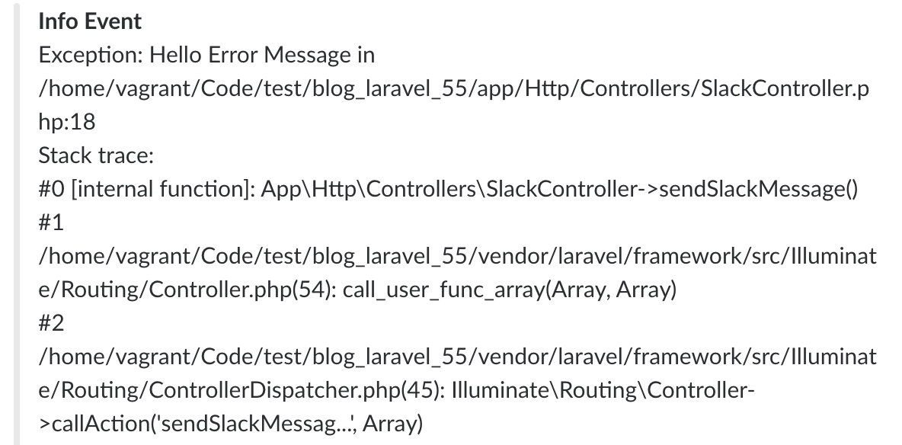
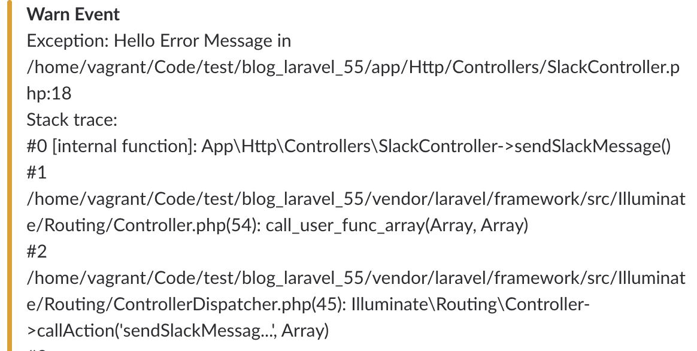
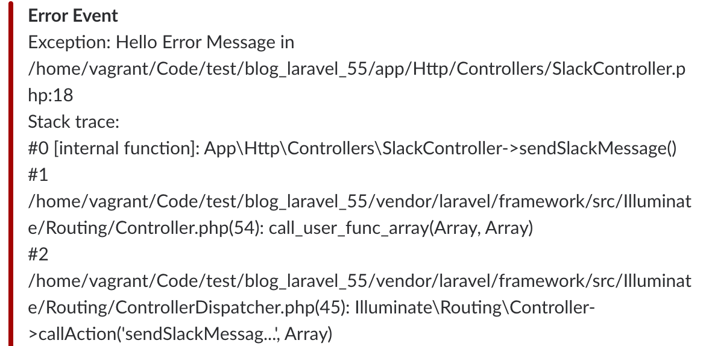

# Slack Log

## Slack Logging

> 版本：Laravel 5.6 內建 Slack Logging

**1. 加入 Slack App**

加入新的 App 到 Slack


**2. 搜尋 Slack App Incoming Webhook**


搜尋 `Incoming Webhook`，讓 Laravel 可以發送訊息到 Slack


**3. Slack App Incoming Webhook 加入設定**


**4. 取得 Slack App Incoming Webhook 網址**


**5. 設定 log 方式**

在 `config/logging.php` 檔案中的 `stack` 加入 `slack` 設定，這樣 Log 資料會記錄到 Log File 及 Slack

```php
// config/logging.php
return [
    'default' => env('LOG_CHANNEL', 'stack'),
    'channels' => [
        'stack' => [
            'driver' => 'stack',
            'channels' => ['single', 'slack'],
        ],
        'slack' => [
            'driver' => 'slack',
            'url' => env('LOG_SLACK_WEBHOOK_URL'),
            'username' => 'Laravel Log',
            'emoji' => ':boom:',
            'level' => 'debug',
        ],
    ],
];
```

設定 `.env` 檔案，將 `Slack Incoming Webhook 網址` 設定到 `LOG_SLACK_WEBHOOK_URL`

```shell
LOG_SLACK_WEBHOOK_URL=https://hooks.slack.com/services/XXXXXXXXXX
```

**6. 檢視 Slack Laravel Log**

當程式使用 `Log::error('WFT Error Log');` 去紀錄 Log 或有任何的 Exception 就可以在 Slack 看到了


## Laravel Slack Log

> 版本：Laravel 5.5 套件 [cr0wst/laravel-slack-log: Utilizes Laravel's notifications to provide logging to slack at various levels. Inspired by Log4j.](https://github.com/cr0wst/laravel-slack-log)


**1. 安裝套件**

```shell
composer require smcrow/laravel-slack-log
```

**2. 設定 config/app.php**

```php
<?php
// config/app.php
return [
    'aliases' => [
        'SlackLog' => \Smcrow\SlackLog\Facades\SlackLog::class
    ],
];
```


**3. 建立設定檔**


```shell
php artisan vendor:publish
```

**4. 丟出例外 Slack Log**

```php
<?php

try {
    throw new Exception('Hello Error Message');
} catch (Exception $exception) {
    SlackLog::debug($exception);
    SlackLog::debug($exception);
    SlackLog::trace($exception);
    SlackLog::info($exception);
    SlackLog::warn($exception);
    SlackLog::error($exception);
}
```

**5. Log 等級及顯示方式**

1. DEBUG
2. TRACE
3. INFO
4. WARN
5. ERROR

*1. DEBUG*



*2. TRACE*



*3. INFO*



*4. WARN*



*5. ERROR*




## 參考資料

**Laravel 5.3**

* [Sending Slack Notifications from Your Laravel App – Olayinka Omole – Medium](https://medium.com/@olayinka.omole/sending-slack-notifications-from-your-laravel-app-1bdb6e4e4127)

**Laravel 5.5**

* [gpressutto5/laravel-slack: Slack notification for Laravel as it should be. Easy, fast, simple and highly testable.](https://github.com/gpressutto5/laravel-slack)
* [cr0wst/laravel-slack-log: Utilizes Laravel's notifications to provide logging to slack at various levels. Inspired by Log4j.](https://github.com/cr0wst/laravel-slack-log)

**Laravel 5.6**

* [Enviando logs para o Slack no Laravel - YouTube](https://www.youtube.com/watch?v=FuNZCdv8u-o)
* [Logging - Laravel - The PHP Framework For Web Artisans](https://laravel.com/docs/5.6/logging)
* [Notifications - Laravel - The PHP Framework For Web Artisans](https://laravel.com/docs/5.6/notifications#slack-notifications)


**不限 Laravel 版本**

* [maknz/slack: A simple PHP package for sending messages to Slack, with a focus on ease of use and elegant syntax.](https://github.com/maknz/slack)
* [Laravel Slack - Laravel Tips 'N Tricks](http://laraveltnt.com/laravel-slack/)

**Slack**
* [Slack Imcoming webhooks](https://slack.com/apps/A0F7XDUAZ-incoming-webhooks)


**CloudWatch Slack**
* [jamesfairhurst/laravel-cloudwatch-logs-lambda-slack: Use AWS CloudWatch Logs & Lambda to post Laravel Log messages to Slack](https://github.com/jamesfairhurst/laravel-cloudwatch-logs-lambda-slack)
* [Using AWS CloudWatch for Laravel Logs on Forge – James Fairhurst – Medium](https://medium.com/@james_fairhurst/using-aws-cloudwatch-for-laravel-logs-on-forge-27590ee4fe33)

**討論文章**
* [L5 Monolog with Slack integration](https://laracasts.com/discuss/channels/general-discussion/l5-monolog-with-slack-integration)


!INCLUDE "../../kejyun/book/laravel-5-for-beginner.md"
