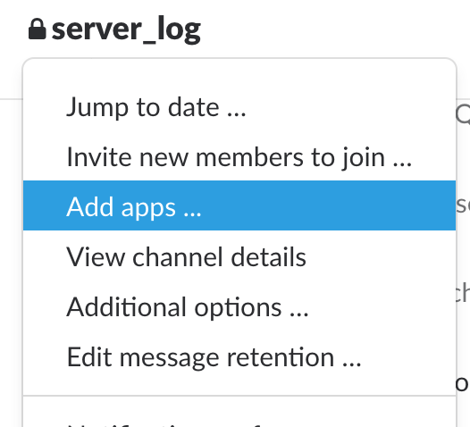
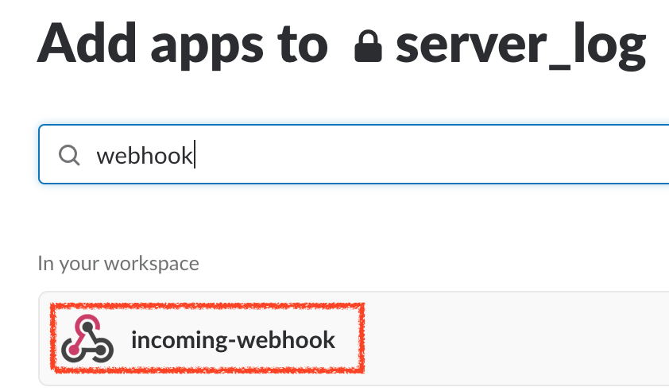
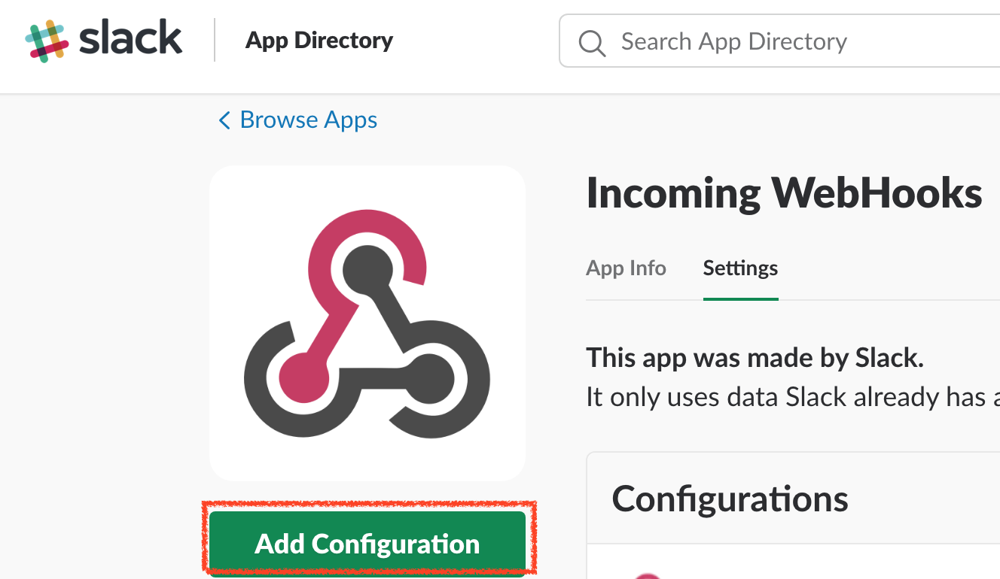
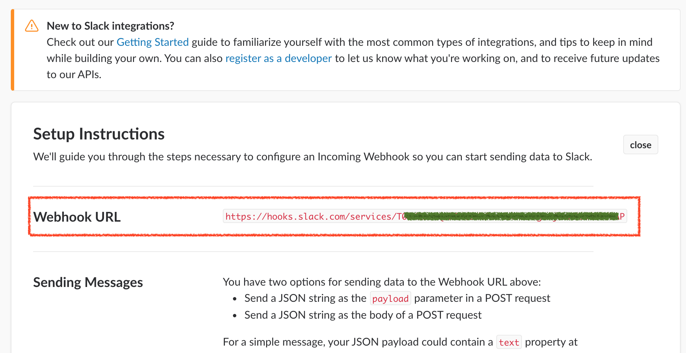
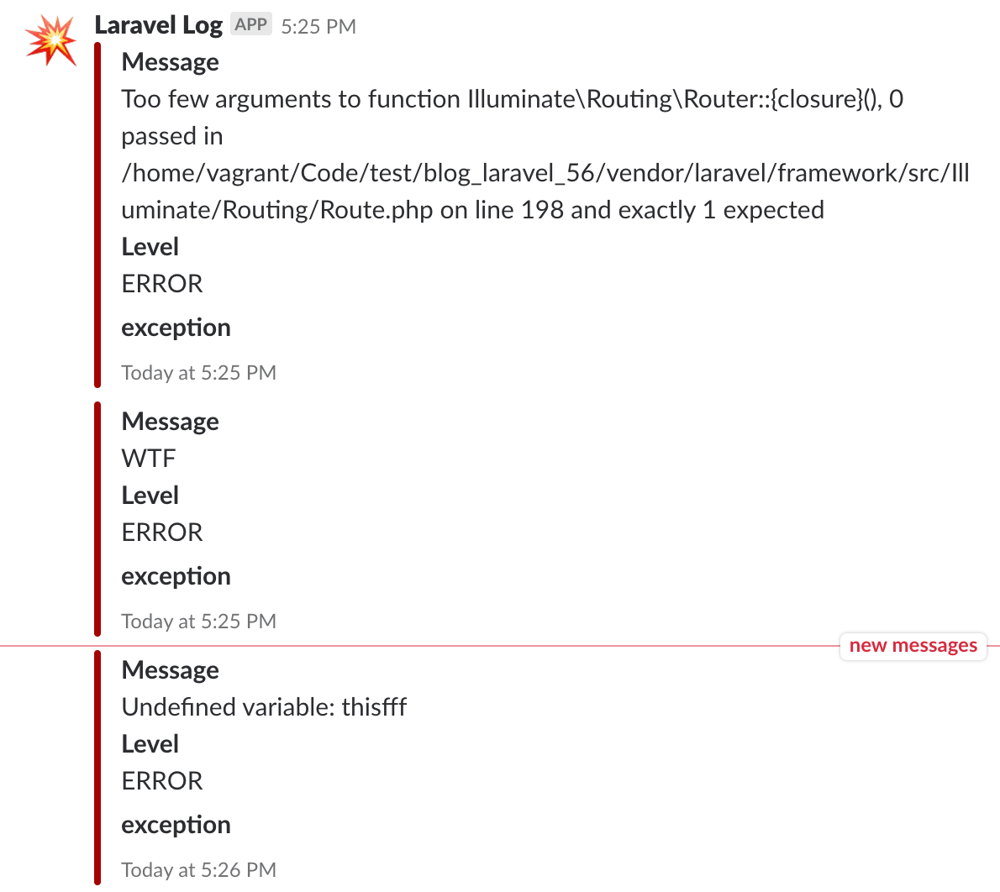

# Slack Log

## Laravel 5.6 Slack Logging

**1. 加入 Slack App**

加入新的 App 到 Slack



**2. 搜尋 Slack App Incoming Webhook**


搜尋 `Incoming Webhook`，讓 Laravel 可以發送訊息到 Slack



**3. Slack App Incoming Webhook 加入設定**



**4. 取得 Slack App Incoming Webhook 網址**




**5. 設定 log 方式**

在 `config/logging.php` 檔案中的 `stack` 加入 `slack` 設定，這樣 Log 資料會記錄到 Log File 及 Slack

```php
// config/logging.php
return [
    'default' => env('LOG_CHANNEL', 'stack'),
    'channels' => [
        'stack' => [
            'driver' => 'stack',
            'channels' => ['single', 'slack'],
        ],
        'slack' => [
            'driver' => 'slack',
            'url' => env('LOG_SLACK_WEBHOOK_URL'),
            'username' => 'Laravel Log',
            'emoji' => ':boom:',
            'level' => 'debug',
        ],
    ],
];
```

設定 `.env` 檔案，將 `Slack Incoming Webhook 網址` 設定到 `LOG_SLACK_WEBHOOK_URL`

```shell
LOG_SLACK_WEBHOOK_URL=https://hooks.slack.com/services/XXXXXXXXXX
```

**6. 檢視 Slack Laravel Log**

當程式使用 `Log::error('WFT Error Log');` 去紀錄 Log 或有任何的 Exception 就可以在 Slack 看到了



## 參考資料
* [Sending Slack Notifications from Your Laravel App – Olayinka Omole – Medium](https://medium.com/@olayinka.omole/sending-slack-notifications-from-your-laravel-app-1bdb6e4e4127)
* [L5 Monolog with Slack integration](https://laracasts.com/discuss/channels/general-discussion/l5-monolog-with-slack-integration)
* [Slack Imcoming webhooks](https://slack.com/apps/A0F7XDUAZ-incoming-webhooks)
* [maknz/slack: A simple PHP package for sending messages to Slack, with a focus on ease of use and elegant syntax.](https://github.com/maknz/slack)
* [Laravel Slack - Laravel Tips 'N Tricks](http://laraveltnt.com/laravel-slack/)
* [gpressutto5/laravel-slack: Slack notification for Laravel as it should be. Easy, fast, simple and highly testable.](https://github.com/gpressutto5/laravel-slack)
* [Enviando logs para o Slack no Laravel - YouTube](https://www.youtube.com/watch?v=FuNZCdv8u-o)
