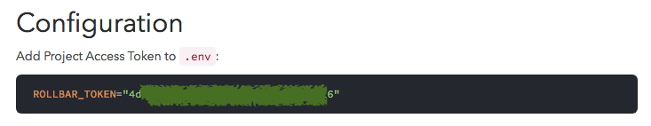
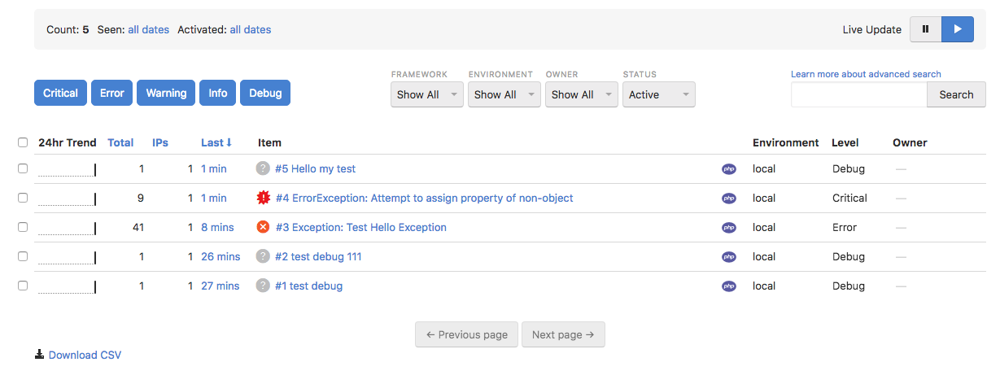
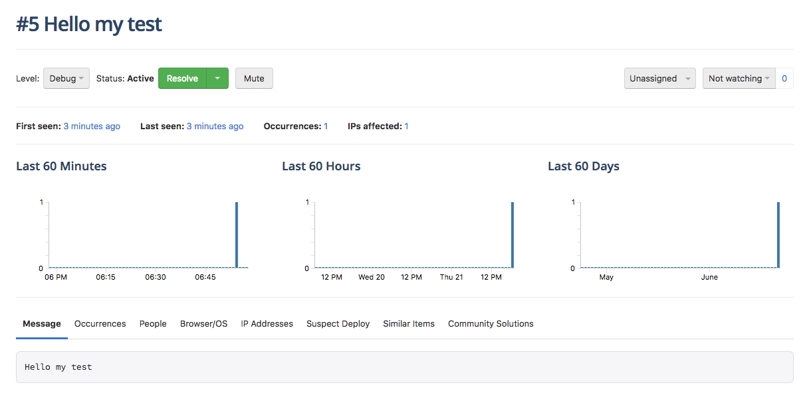
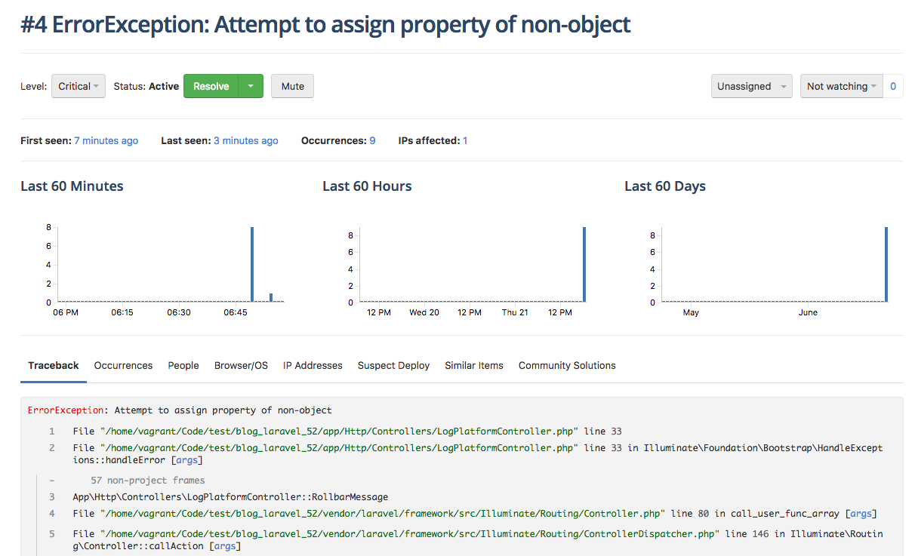
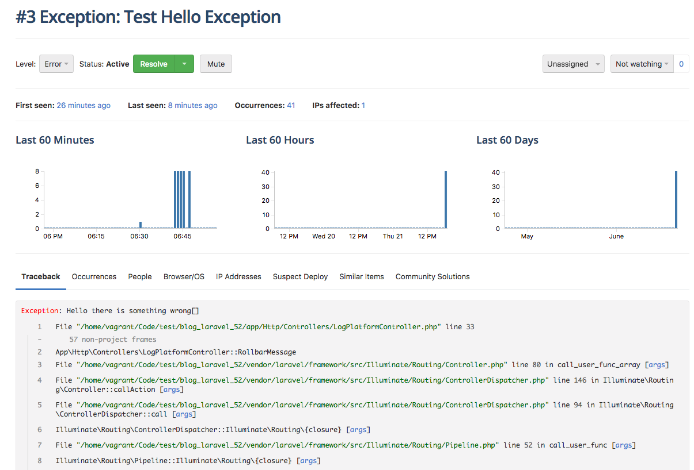

# Rollbar

**1. 安裝**

```shell
composer require rollbar/rollbar-laravel
```

**2. 設定 config/app.php**

> Laravel 5.5 以上不用做這個設定

```php
<?php
// config/app.php
return [
    'providers' => [
        Rollbar\Laravel\RollbarServiceProvider::class,
    ],
];
```


**3. 設定 API KEY**

到 `.env` 檔案設定 API KEY，根據官方安裝引導可以取得此 API KEY

```shell
# .env
ROLLBAR_TOKEN=<API_KEY>
```



**4. 發送錯誤訊息到 rollbar**

```php
try {
    throw new Exception('Hello there is something wrong');
} catch (Exception $exception) {
    Log::debug($exception);
    Log::debug('Hello my test');
}
```

**5. 檢視 rollbar 錯誤訊息**

*錯誤訊息 dashboard*



*個別錯誤訊息*








## 參考資料
* [Error Tracking & Crash Reporting for Software Developers - Rollbar](https://rollbar.com/)
* [Rollbar Doc - Laravel](https://docs.rollbar.com/docs/laravel)


!INCLUDE "../../kejyun/book/laravel-5-for-beginner.md"
