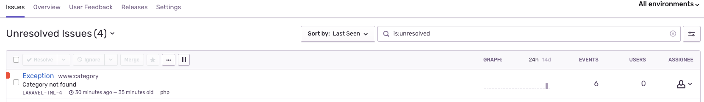

# Sentry.io

> 紀錄 Laravel Exception

**1.安裝套件**

```shell
composer require sentry/sentry-laravel
```

**2.加入套件設定**

在 `config/app.php` 檔案中加入設定

```php
<?php
// config/app.php
return [
    'providers' => [
        Sentry\SentryLaravel\SentryLaravelServiceProvider::class,
    ],
    'aliases' => [
        'Sentry' => Sentry\SentryLaravel\SentryFacade::class,
    ],
]
```

**3.錯誤處理加入 Sentry 設定**

在 `config/app.php` 檔案中加入設定

```php
<?php

class Handler extends ExceptionHandler
{

    public function report(Exception $e)
    {
        if (app()->bound('sentry') && $this->shouldReport($e)) {
            app('sentry')->captureException($e);
        }

        return parent::report($e);
    }

}
```

**4.發佈設定**

```shell
php artisan vendor:publish --provider="Sentry\SentryLaravel\SentryLaravelServiceProvider"
```

**5.設定 .env 檔案**

```shell
SENTRY_LARAVEL_DSN=https://<SENTRY_DSN_URL>
```



## 參考資料
* [Sentry | Error Tracking Software — JavaScript, Python, PHP, Ruby, more](https://sentry.io/)

!INCLUDE "../../kejyun/book/laravel-5-for-beginner.md"
