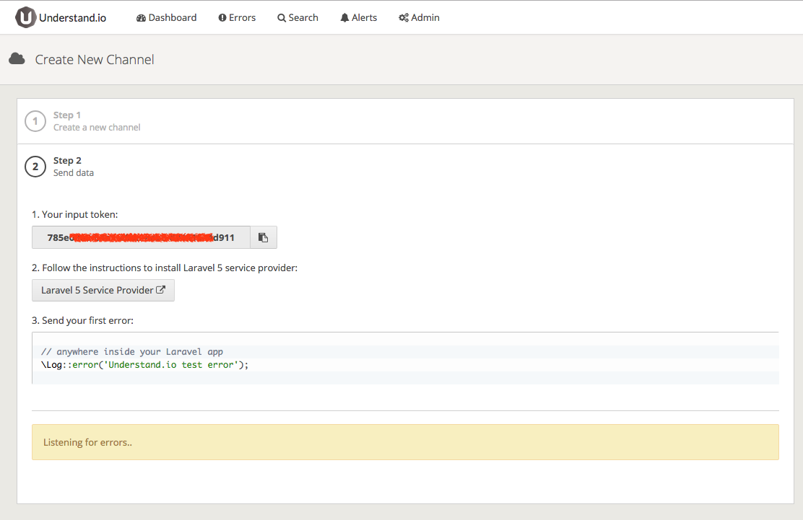
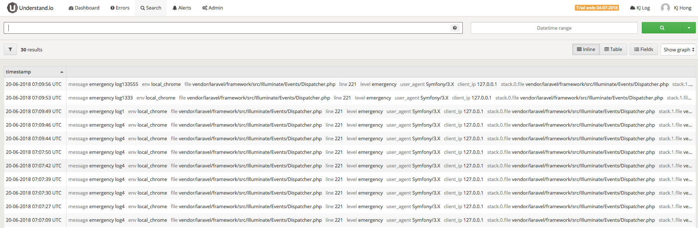

# Understand.io

> 紀錄 Laravel Log

在 [understand/understand-laravel5](https://github.com/understand/understand-laravel5/#laravel-5-service-provider-for-understandio) 套件 github，依照步驟安裝 Understand.io




**1.安裝套件**

```shell
composer require understand/understand-laravel5
```

**2.加入套件設定**

在 `config/app.php` 檔案中加入設定

```php
<?php
// config/app.php
return [
    'providers' => [
        Understand\UnderstandLaravel5\UnderstandLaravel5ServiceProvider::class,
    ],
]
```


**3.設定 .env 檔案**

```shell
UNDERSTAND_ENABLED=true
UNDERSTAND_TOKEN=<API TOKEN 放這裡>
```


**4.紀錄 Log**

```php
<?php

\Log::error('Understand.io test error');
```




## 參考資料
* [Understand.io - Online Event and Log Management](https://understand.io/)
* [understand/understand-laravel5](https://github.com/understand/understand-laravel5/#laravel-5-service-provider-for-understandio)


!INCLUDE "../../kejyun/book/laravel-5-for-beginner.md"
