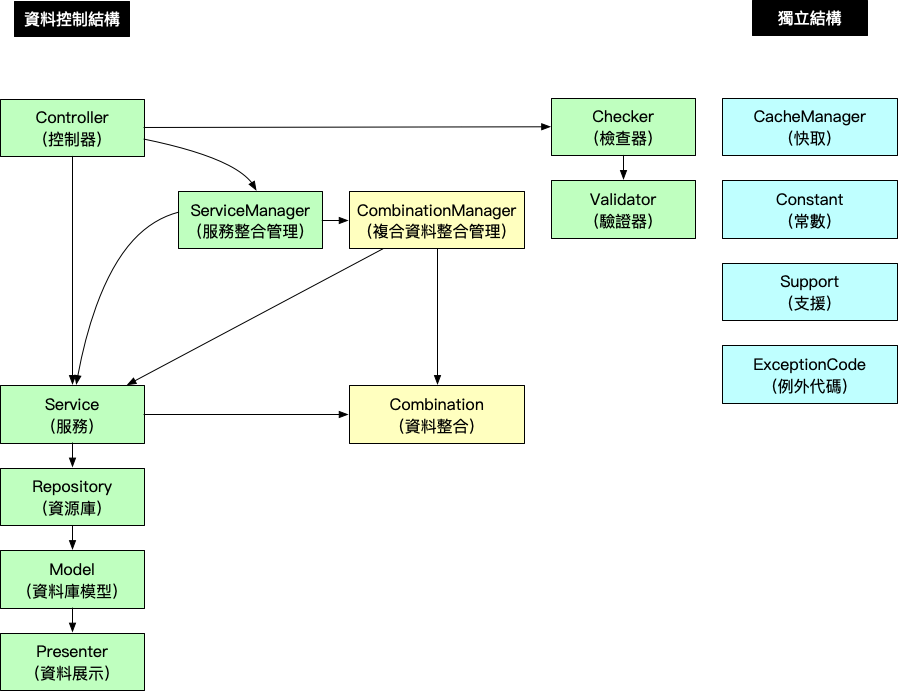

# Combination & Cache 架構設計準則（2019 年版本）

傳統的 MVC（Model, View, Controller） 框架，當 Controller 收到請求之後，我們會在 Controller 內直接透過 Model 去撈取資料庫的資料，並在 Controller 做資料驗證、資料整合、快取、商業邏輯判斷...等等的工作。

當系統越來越大，會發現很多類似的商業邏輯的程式都散在各地，沒有辦法重複再利用，當程式需要異動或修改的時候，就要去搜尋所有程式碼，把許多相同商業邏輯的程式碼去做異動，但需要修改的地方若太多，往往會東漏西漏，導致系統出現錯誤，並造成往後開發的時間成本增加。

所以我們會想要做到 `減少重複的程式碼`、`提高維護開發的效率`，所以將程式碼依照`分類`及`分層`抽出獨立控管，讓不同類型的程式專心處理自己相關的商業邏輯，讓開發維護更容易。

隨著程式架構的演進會發展出更多不同的架構，所以這個設計架構準則也是會隨著時間做演進的。

## 資料處理邏輯分層

### 架構圖



### 架構說明

#### A. 資料控制結構

```
* Controller (控制器：控制資料流程)
    * ServiceManager (服務整合管理：組合管理不同 Service 的商業邏輯)
        * Service (服務：處理商業邏輯)
            * Repository (資源庫：資料表資料撈取邏輯)
                * Model (資料庫模型：資料表設定)
                    * Presenter (資料呈現：資料表資料格式呈現轉換)
            * Combination（資料整合：整理 Repository 資料成資訊）
    * CombinationManager（複合資料整合管理：整理多個 Service 的資料成資訊）
* Checker (檢查器：根據 Controller 所需商業邏輯，驗證不同資料表欄位資料)
    * Validator (驗證器：資料表欄位資料驗證)
 ```

 | 結構名稱 | 說明 |
 |---|---|
 | Controller (控制器) | 控制資料流程，控制要使用哪些 Service 或 ServiceManager 的商業邏輯，去組合出使用者請求需要的資料，並做資料的資料交易控制 (transaction) ，並使用 Checker 去檢查任何使用者傳進來的資料，確保資料的正確性 |
 | ServiceManager (服務整合管理)  |  協助 Controller 組合不同 Service 的資料成商業邏輯 |
 | Service (服務)  |  處理商業邏輯，組合不同的 Repository 資料成商業邏輯，提供 Controller 或 ServiceManager 存取 |
 | Repository (資源庫)  |  資料表資料撈取邏輯，撈取屬於自己 Model 不同條件下的資料，提供 Service 存取 |
 | Model (資料庫模型)  | 資料庫模型，資料表存取相關設定 |
 | Presenter (資料呈現)  | 資料呈現，協助 Model 做資料呈現轉換 |
 | Checker (檢查器) | 協助 Controller 做資料驗證，在資料進入到程式邏輯前，都需要經過 Checker 將資料格式做驗證 |
 | Validator (驗證器) | 協助 Checker 做資料驗證，Validator 只能驗證單一 Model 資料 |
 | CombinationManager (複合資料整合管理)  | 協助整理不同 Service 的複合式資料，若有資料的邏輯判斷需要不同的資料來源，則由 CombinationManager 負責整合處理 |
 | Combination （資料整合） | 協助整理 Repository 資料成資訊|


#### B.獨立結構

```
* CacheManager (快取：管理資源快取鍵值及清除快取)
* Constant (常數：定義資料狀態名稱)
* Support (支援：協助處理獨立邏輯資料處理)
* ExceptionCode (例外代碼：例外錯誤代碼定義)
```

| 結構名稱 | 說明 |
|---|---|
| CacheManager (快取)  | 協助專案資料做快取資料的控制，可以在任何程式邏輯複雜的地方做快取存取控制，並統一清除快取 |
| Constant (常數)  | 定義並命名所有資料狀態，確保資料值做異動時，不會影響程式邏輯 |
| Support (支援)  | 協助處理獨立程式邏輯，邏輯沒有被其他任何的函式綁定，可以獨立完成 |
| ExceptionCode (例外代碼)  | 定義例外代碼，可以統一管控當例外發生錯誤時，回傳的錯誤代碼 |

### 架構存取限制

1. 不能跨 2 階層以上存取
    * Controller 不能存取 Repository
    * Controller 不能存取 Validator
    * Service 不能存取 Model
2. 低階層的不能存取高階層的資料
    * Model 不能存取 Repository
    * Repository 不能存取 Service
    * Validator 不能存取 Checker
3. 同一個資料類型，不能互相呼叫
    * 避免同一類型類別呼叫，造成 new 物件的時候有無窮迴圈
        * PostService 存取 UserService，UserService 存取 PostsService 造成無窮迴圈
    * ServiceManager 不能呼叫 ServiceManager
    * Service 不能呼叫 Service
    * Checker 不能呼叫 Checker
    * Validator 不能呼叫 Validator
    * Repository 不能呼叫 Repository
    * CacheManager 不能呼叫 CacheManager
4. 獨立結構可以在任何一階層去呼叫


## 架構設計邏輯範例說明

### A. 資料控制結構

#### Controller (控制器)

| 項目 | 說明 |
|---|---|
| 用途 | 控制資料流程 |
| 可以存取結構 | `Checker`、`ServiceManager`、`Service`、`DB transaction`，`所有獨立結構` |
| 可以被存取結構 | 無 |


處理 HTTP 請求的入口，依照需求呼叫 ServiceManager 或 Service 去做資料的存取，大部分情況呼叫 Service 去組合需要的資料就好，若相同的組合邏輯在不同的 Controller 都有用到，那就使用 ServiceManager 去組合不同的 Service

要確保所有 Service 商業邏輯都正確跑完才允許對資料做異動，並避免 Transaction 在 Controller 及 Service 被重複呼叫，導致無法正確鎖定資料狀態，所以使用 Controller 當作資料交易（Transaction）的控制點


```php
<?php

class PostController extends Controller
{
    public function __construct(
        PostServiceManager $PostServiceManager,
        PostService $PostService,
        CommentService $CommentService,
        PostChecker $PostChecker
    )
    {
        $this->PostServiceManager = $PostServiceManager;
        $this->PostService = $PostService;
        $this->CommentService = $CommentService;
        $this->PostChecker = $PostChecker;
    }

    // 顯示文章
    public function show($post_id) {
        try {
            // 驗證資料
            $input = [
                'post_id' => $post_id
            ];
            $this->PostChecker->checkShow($input);

            // 撈取文章
            $Post = $this->PostServiceManager->findPost($post_id);

            // 撈取文章留言
            $Comment = $this->CommentService->getCommentByPostId(post_id);
        } catch (Exception $exception) {
            throw $exception
        }
    }

    // 更新文章
    public function update($post_id) {
        try {
            // 驗證資料
            $input = request()->all();
            $input['post_id'] = $post_id;
            $this->PostChecker->checkUpdate($input);

            // 交易開始
            DB::beginTransaction();

            // 更新文章
            $Post = $this->PostService->update($post_id, $input);

            // 交易結束
            DB::commit();
        } catch (Exception $exception) {
            // 交易失敗
            DB::rollBack();
            throw $exception
        }
    }
}
```


#### ServiceManager (服務整合管理)

| 項目 | 說明 |
|---|---|
| 用途 | 組合管理不同 Service 的商業邏輯 |
| 可以存取結構 | `Service`、`所有獨立結構` |
| 可以被存取結構 | `Controller` |

使用不同 Service 撈取資料，將不同資料組合成商業邏輯，供 Controller 做存取

```php
<?php

class PostServiceManager {
    public function __construct(
        PostService $PostService,
        UserService $UserService
    )
    {
        $this->PostService = $PostService;
        $this->UserService = $UserService;
    }

    // 撈取文章資料
    public function findPost($post_id){
        try {
            // 撈取文章
            $Post = $this->PostService->findPost($post_id);
            // 撈取文章作者資料
            $user_id = $Post->user_id;
            $Post->user = $this->UserService->findUser($user_id);

            return $Post;
        } catch (Exception $exception) {
            throw $exception
        }
    }
}
```

#### Service (服務)


| 項目 | 說明 |
|---|---|
| 用途 | 處理商業邏輯 |
| 可以存取結構 | `Repository`、`所有獨立結構` |
| 可以被存取結構 | `Controller`、`ServiceManager` |

使用不同的 Repository 撈取資料，將不同資料組合成商業邏輯


```php
<?php

class PostService {
    public function __construct(
        PostRepository $PostRepository,
        PostTagRepository $PostTagRepository
    )
    {
        $this->PostRepository = $PostRepository;
        $this->PostTagRepository = $PostTagRepository;
    }

    // 撈取文章
    public function findPost($post_id) {
        try {
            // 撈取文章
            $Post = $this->PostRepository->find($post_id);
            // 撈取文章標籤
            $Tag = $this->PostTagRepository->getByPostId($post_id);

            return [$Post, $Tag];
        } catch (Exception $exception) {
            throw $exception
        }
    }
}
```


#### Repository (資源庫)

| 項目 | 說明 |
|---|---|
| 用途 | 資料表資料撈取邏輯 |
| 可以存取結構 | `Model`、`所有獨立結構` |
| 可以被存取結構 | `Service` |

撈取特定 Model 資料，像 `PostRepository` 可以存取 `Post` Model (模型) 的 *基本資料*，並使用不同條件撈取 Model 的資料，供 Service 做存取

也可以使用 `PostRecommendRepository` 存取 `Post` Model (模型) 的 *推薦資料*

同一個 Model (模型) 可以用不同的 Repository 去呼叫，但同一 Repository 只能有一個 Model (模型)

```php
<?php

class PostRepository {
    public function __construct(
        Post $Post
    )
    {
        $this->Post = $Post;
    }

    public function find($post_id) {
        try {

            // 撈取資料庫文章資料
            $Post = $this->Post->find($post_id);

            return $Post;
        } catch (Exception $exception) {
            throw $exception
        }
    }

    public function findLatestPost() {
        try {
            // 撈取資料庫文章資料
            $Post = $this->Post
                ->order('created_at', 'desc')
                ->first();

            return $Post;
        } catch (Exception $exception) {
            throw $exception
        }
    }
}
```

#### Model (資料庫模型)

| 項目 | 說明 |
|---|---|
| 用途 | 資料表設定 |
| 可以存取結構 | `所有獨立結構` |
| 可以被存取結構 | `Repository` |

Eloquent 存取資料表相關設定，使用 Eloquent 直接存取資料表資料

```php
<?php

class Post extends Model
{
    protected $table = 'post';

    protected $fillable = [];

    protected $primaryKey = 'id';

    protected $dates = ['created_at', 'updated_at'];

    protected $presenter = PostPresenter::class;
}
```


#### Presenter (資料呈現)

| 項目 | 說明 |
|---|---|
| 用途 | 資料表資料格式呈現轉換 |
| 可以存取結構 | `所有獨立結構` |
| 可以被存取結構 | `Model` |

提供 Model 的資料用其他方式呈現

```php
<?php

class PostPresenter extends Presenter
{
    public function created_at_human_time()
    {
        return $this->created_at->diffForHumans();
    }
}
```

#### Checker (檢查器)

| 項目 | 說明 |
|---|---|
| 用途 | 根據 Controller 所需商業邏輯，驗證不同資料表欄位資料 |
| 可以存取結構 | `Validator`、`所有獨立結構` |
| 可以被存取結構 | `Controller` |

協助 Controller 驗證不同資料表資料的正確性，若驗證錯誤則丟處例外，Controller 根據例外代碼去做處理

```php
<?php

class PostValidator {
    public function checkFindPost($input){
        // 驗證文章資料
        $this->PostValidator->validatePostId($input);
        $this->PostValidator->validatePostContent($input);

        // 驗證會員資料
        $this->MemberValidator->validateMemberId($input);
    }
}
```

#### Validator (驗證器)

| 項目 | 說明 |
|---|---|
| 用途 | 資料表欄位資料驗證 |
| 可以存取結構 | `所有獨立結構` |
| 可以被存取結構 | `Checker` |

協助 Checker 驗證資料的正確性，若驗證錯誤則丟處例外，Checker 根據例外代碼去做處理

```php
<?php

class PostValidator {
    public function validatePostId($input){
        // 設定驗證規則
        $rules = [
            'post_id' => [
                'required',
                'max:20',
            ],
        ];

        // 開始驗證
        $this->validator = Validator::make($input, $rules);

        if ($this->validator->fails()) {
            throw new Exception(
                '文章編號格式錯誤',
                PostExceptionCode::POST_ID_FORMAT_ERROR
            );
        }
    }
}
```


#### Combination（資料整合）

| 項目 | 說明 |
|---|---|
| 用途 | 整理 Repository 資料成資訊 |
| 可以存取結構 | `所有獨立結構` |
| 可以被存取結構 | `Serivce`、`CombinationManager` |

當 Service 從 Repository 取得資料後，協助整理判斷 Repository 資料的屬性狀態，像是可以從 *文章編號* 取得 *文章網址*

```php
<?php

class PostsCombination {
    // 設定整合資訊
    public function setCombinationInfo(&$Posts)
    {
        if (!($Posts instanceof Posts)) {
            return false;
        }

        // 文章網址
        $url = url("article/{$Posts->id}")

        $Posts->info->url = $url;
    }
}
```

#### CombinationManager（複合資料整合管理）

| 項目 | 說明 |
|---|---|
| 用途 | 整理多個 Service 的資料成資訊 |
| 可以存取結構 | `Combination`、`Serivce`、`所有獨立結構` |
| 可以被存取結構 | `ServiceManager`、`Controller` |

當整合的資料需要經過不同的資料來源去判斷要產生什麼複合資訊，CombinationManager 協助整理不同來源的資料去做資料整合，目前會從 ServiceManager 去取得不同 Service 的資訊，所以將 CombinationManager 放在這一階層去進行呼叫

```php
<?php

class PostsCombinationManager {
    protected $UserService;
    public function __construct(
        UserCombination $UserCombination,
        ProjectService $ProjectService
    ) {
        // 服務
        $this->UserCombination = $UserCombination;
    }

    public function setCombinationInfo(&$combination_data)
    {
        $Posts = array_get($combination_data, 'Posts');
        if ($Posts instanceof Posts) {
            // 設定文章關聯作者資訊
            $this->UserCombination->setCombinationInfo($Posts->User);

            // 是專題文章
            if ($Posts->type == PostsConstant::TYPE_PROJECT) {
                $Project = $this->ProjectService->findProjectByPostId($Posts->id);
                $url = url("project/{$Project->slug}/{$Posts->id}")
                $Posts->info->url = $url;
            };
        }
    }
}

```

### B.獨立結構


#### CacheManager (快取)

| 項目 | 說明 |
|---|---|
| 用途 | 管理資源快取鍵值及清除快取 |
| 可以存取結構 | x |
| 可以被存取結構 | 無限制 |

在 *複雜* 的資料庫查詢（Repository）或是商業邏輯（Service、ServiceManager），想要在一定時間內不要再重複的進行複雜的運算，可以透過快取將運算的結果快取起來

*PostsCacheManager 文章資源庫*

```php
class PostRepository {
    public function __construct(
        Post $Post,
        PostsCacheManager $PostsCacheManager
    )
    {
        $this->Post = $Post;
        $this->PostsCacheManager = $PostsCacheManager;
    }

    public function find($post_id) {
        try {
            $cache_key = $this->PostsCacheManager->getPostIdCacheKey($post_id);
            $Posts = $this->PostsCacheManager->getCache($cache_key);
            if (!is_null($Posts)) {
                return $Posts;
            }

            // 撈取資料庫文章資料
            $Posts = $this->Post->find($post_id);

            if (!is_null($Posts)) {
                // 有該資料，將資料存入快取
                $this->PostsCacheManager->putCache($Posts, $cache_key);
            }

            return $Posts;
        } catch (Exception $exception) {
            throw $exception
        }
    }

    public function findLatestPost() {
        try {
            // 撈取資料庫文章資料
            $Post = $this->Post
                ->order('created_at', 'desc')
                ->first();

            return $Post;
        } catch (Exception $exception) {
            throw $exception
        }
    }
}
```

*PostsCacheManager 文章快取*

```php
class PostsCacheManager {
    protected $cache_key = [
        // 文章快取
        'post_id' => '[PostById][post_id:{post_id}]',
        // 已發布文章快取
        'published_post_id' => '[PublishedPostById][post_id:{post_id}]',
    ];

    /**
     * 文章快取
     */
    public function getPostIdCacheKey($post_id)
    {
        $search = [
            '{post_id}',
        ];
        $replace = [
            $post_id,
        ];
        $cache_key = str_replace($search, $replace, $this->cache_key['post_id']);

        return $cache_key;
    }

    /**
     * 已發布文章快取
     */
    public function getPublishedPostIdCacheKey($post_id)
    {
        $search = [
            '{post_id}',
        ];
        $replace = [
            $post_id,
        ];
        $cache_key = str_replace($search, $replace, $this->cache_key['published_post_id']);

        return $cache_key;
    }

    /**
     * 文章快取
     */
    public function getPostIdCacheKey($post_id)
    {
        $search = [
            '{post_id}',
        ];
        $replace = [
            $post_id,
        ];
        $cache_key = str_replace($search, $replace, $this->cache_key['post_id']);

        return $cache_key;
    }


    /**
     * 清除文章快取
     */
    public function forgetPostsCache($cache_data)
    {
        $Posts = array_get($cache_data, 'Posts');


        if (!is_null($Posts) AND ($Posts instanceof Posts)) {
            $cache_key = $this->getPostIdCacheKey($post_id);
            $is_cache_forget = $Cache::forget($cache_key);

            $cache_key = $this->getPublishedPostIdCacheKey($post_id);
            $is_cache_forget = $Cache::forget($cache_key);

            // .... 清除文章其他快取
        }
    }
}
```


#### Constant (常數)

| 項目 | 說明 |
|---|---|
| 用途 | 定義資料狀態名稱 |
| 可以存取結構 | x |
| 可以被存取結構 | 無限制 |

資料皆為靜態變數，可以供所有資料層級 (e.g. Controller、Service、Repository) 做存取

```php
<?php

class PostConstant {
    const POST_TYPE_PUBLIC = 'P';
    const POST_TYPE_DELETE = 'D';
}
```


#### Support (支援)

| 項目 | 說明 |
|---|---|
| 用途 | 協助處理獨立邏輯資料處理 |
| 可以存取結構 | x |
| 可以被存取結構 | 無限制 |

方法皆為靜態變數，可以供所有資料層級 (e.g. Controller、Service、Repository) 做存取

若有其他可供全域共用的方法皆寫在 Support 靜態方法供大家存取

```php
<?php

class PostSupport {
    // 撈取所有文章類型
    public static function getAllPostType() {
        $all_post_type = [
            PostConstant::POST_TYPE_PUBLIC,
            PostConstant::POST_TYPE_DELETE,
        ];
        return $all_post_type;
    }
}
```


#### ExceptionCode (例外代碼)

| 項目 | 說明 |
|---|---|
| 用途 | 例外錯誤代碼定義 |
| 可以存取結構 | x |
| 可以被存取結構 | x |


資料皆為靜態變數，可以供所有資料層級 (e.g. Controller、Service、Repository) 做存取

```php
<?php

class PostExceptionCode {
    const POST_ID_FORMAT_ERROR = 10000001;
    const POST_NOT_FOUND = 10000002;
    const POST_TAG_NOT_FOUND = 10000003;
}
```


## View (視圖) 使用限制

`View` 的職責是負責顯示資料，所有的資料應由 `Controller` 準備好再傳給 `View`，所以`不要`在 `View` 內有複雜的程式判斷邏輯，在 `View` 裡面只有 `if`, `for`, `foreach` 跟 `echo 列印` 的程式，僅需要將資料呈現在對的 HTML 裡面，不要再對資料重複處理過。

像是文章的網址可能會因為類型不同會有不同的網址，像是一般文章網址可能為 `http://kejyun.com/post/1`，而影音文章網址可能為 `http://kejyun.com/video/2`，兩者的資料皆為 Post 資料表的資料，在 `View` 中要顯示網址應為 `echo $Post->post_url;` 將網址印出，`post_url` 則是在傳給 `View` 之前就經過邏輯判斷的資料，而不是在 `View` 中判斷不同文章類型（`PostConstant::POST_TYPE_NORMAL`, `PostConstant::POST_TYPE_VIDEO`）在 View 中顯示不同的網址資料。

之後若文章網址邏輯需要修改，則需要到各個 View 中去修改，很容易漏改道造成系統程式出錯

```php
<a href="{{ $Post->info->post_url }}"> {{ $Post->Title }}</a>
```

!INCLUDE "../kejyun/book/laravel-5-for-beginner.md"
